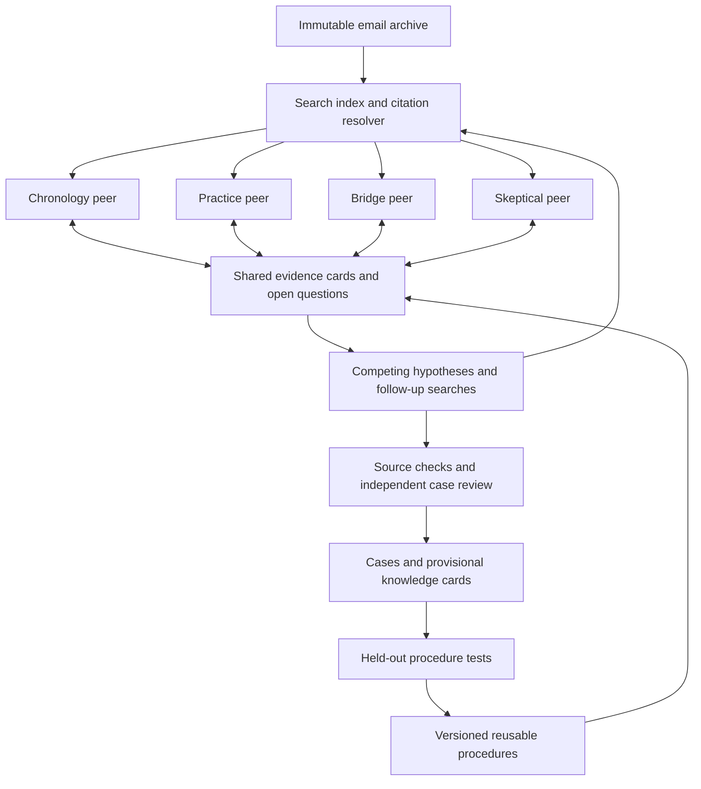

# Discovering fraud indicators and tacit knowledge in Enron emails with a small agent swarm

**Research cutoff: 9 September 2026. Status: proposed application design, grounded in the research and code in this workspace. No Enron investigation was run to produce this document; examples below are hypothetical.**

Build a **four-agent investigative swarm** whose agents independently explore emails, exchange attributable evidence, challenge competing explanations, and publish reusable investigation procedures. Its two outputs should be evidence-backed investigative cases and testable descriptions of implicit organizational practices. The central research question is whether communication and shared memory help discover relationships that equally resourced independent investigators miss.

The strongest design principle from the reviewed literature is to make **evidence acquisition and tested reuse** the unit of cooperation. Conversation, consensus, social activity, and elaborate role assignments are insufficient evidence of collective intelligence. There is no demonstrated, end-to-end state-of-the-art Enron swarm for both fraud discovery and tacit knowledge extraction in the sources reviewed. The architecture here is a synthesis of supported swarm mechanisms, adapted to a substantially harder validation problem.

The broader literature review is in [SWARMS_REPORT.md](SWARMS_REPORT.md). The existing [swarmkit library](README.md) supplies composable coordination methods; this document specifies the Enron application that still needs to be built.

## 1. Define what discovery means

Keep the two products separate because their evidence standards differ.

| Product | Useful output | What does not establish it |
|---|---|---|
| Investigative case | A bounded episode, a possible mechanism, a chronology, supporting and refuting quotations, unresolved premises, and the next discriminating investigation step | A suspicious word, a sender's reputation, sentiment, agent agreement, or an anomaly score |
| Implicit-practice card | A conditional rule about how work appears to happen, its scope and exceptions, and evidence that it helps a fresh investigator on unseen episodes | A plausible organizational story, a paraphrase of an explicit policy, or an agent claiming to have learned something |

Distinguish four levels of knowledge:

1. **Recorded assertion:** an identifiable person wrote a particular statement. This proves the statement exists in the archive, not that its content is true.
2. **Distributed information:** separate emails contain facts that become useful when combined. Swarm evidence exchange directly addresses this problem.
3. **Implicit practice:** repeated actions suggest an unstated norm, informal authority, exception process, or shared vocabulary. This requires inference, comparison, and counterexample search.
4. **Human tacit experience:** skills, intentions, assumptions, or conversations that left no recoverable trace. An email swarm cannot establish these from nothing.

The practical goal is to recover **textually supported traces of implicit knowledge**, then test whether the inferred rules explain or predict additional observations. Avoid interpreting “unspoken” as permission to manufacture motives. Discovery can be new to the investigation without being historically new to the world.

For fraud, maintain distinct fields for suspected mechanism, documentary support, external corroboration, and legal status. A case may deserve review while remaining unresolved. Do not expose a scalar “probability this person is guilty” derived from votes or language-model confidence.

## 2. What swarm research has taught us

The relevant evolution runs from orchestrated conversation and optimizable agent connections toward distributed evidence elicitation, autonomous exploration, and persistent artifacts with external tests.

| Development | Evidence from the reviewed work | Consequence for this project |
|---|---|---|
| **2024: optimizable agent coordination** | GPTSwarm represents language-agent computation and communication as an optimizable graph. Its graph concerns agents and operations.[^1] | Treat communication policy as an experimental variable. A four-agent baseline does not require learning its topology first. |
| **2025–2026: expose hidden information before deciding** | HiddenBench evaluates 65 tasks and 15 models. Distributed-information agents average 30.1% accuracy, versus 80.7% for individuals given complete information; structured exchange improves performance.[^2] | Require agents to disclose useful evidence and missing premises before collective conclusions. More discussion alone is not a solution. |
| **2025–2026: distinguish interaction from sampling** | Debate or Vote finds that independent voting explains much of the gain attributed to debate in its evaluated tasks. The scaling study finds coordination benefits depend on the task.[^3][^4] | Compare the swarm with both a strong single investigator and four isolated investigators at matched budgets and information access. |
| **2026: independent research directions plus shared artifacts** | Anthropic's weak-to-strong researchers use separate experiments and a shared forum; diverse directions help preserve exploration. Its peer-swarm study shows complementary coverage, but scope and compute complicate efficiency comparisons.[^5][^6] | Seed different searches, permit peers to pursue unexpected leads, and measure unique supported discoveries per total cost. |
| **2026: persistent, externally tested collective knowledge** | SwarmWorld evaluates artifacts after agents are removed, under unseen disturbances. Shared societies produce broader, more resilient portfolios, without universally beating isolated search on the strongest artifact.[^7] | Freeze a discovered procedure and test whether a fresh agent benefits on unseen cases. The Enron evaluation analogue must be built; the simulator result does not establish fraud-detection performance. |
| **2026: social activity is not verified learning** | Moltbook studies distinguish apparent peer-learning discourse from measured competence; the latest copying analysis provides an alternative explanation for collective patterns.[^8][^9] | Borrow persistent posts, replies, and artifact forks, but measure uptake and independent validation. Repetition and popularity must not become evidence strength. |
| **2026: adoption needs an independent check** | Gensyn's collaborative autoresearch demo shares experiment results and code, with a protocol calling for local retesting. Research-swarm cheating studies show that shared procedures can also spread invalid strategies.[^10][^11] | A peer must rerun a proposed investigation procedure against protected evaluation data before promoting it to trusted memory. |

HiddenBench is particularly relevant, but its hidden facts are explicitly provided to different agents. It does **not** demonstrate extraction of unrecorded human tacit knowledge. Its exchange-before-decision intervention motivates our protocol; open-ended email investigation adds retrieval errors, ambiguous interpretation, missing records, and uncertain ground truth.

A small internal agent society is useful here: agents maintain identities across investigations, subscribe to unanswered questions, fork useful procedures, and leave inspectable artifacts. The transferable feature of social networks of agents is persistent, selective exchange. A public feed, simulated personalities, follower counts, or a large population is unnecessary to test the underlying discovery mechanism.

## 3. Establish the corpus and its limits

Use the official **CMU Enron Email Dataset** as the initial reproducible source. Its May 7, 2015 release contains roughly half a million messages from about 150 users, mostly senior management. It excludes attachments, incorporates requested removals, and includes address normalization. Preserve these limitations in the dataset manifest rather than treating the archive as complete enterprise communication.[^12]

The ingestion pipeline must preserve raw files and produce a documented normalized view. Record release URL, download hash, file counts, parser version, parse failures, original path, Message-ID, raw and normalized timestamps, timezone ambiguity, participants, subject, and attachment references. Count actual usable documents after ingestion instead of assuming a published headline count matches the processed index.

Separate three forms of duplication:

- **Mailbox copies:** copies of the same message should not count as independent support.
- **Quoted and forwarded text:** a statement reproduced in later emails retains its original evidential origin. Preserve the later transmission as evidence of dissemination when that is the question.
- **Related assertions:** distinct emails may repeat a common rumor or briefing. Different document IDs alone do not establish independent corroboration.

Keep mappings from normalized spans back to immutable source text. Distinguish authored text from quotations, inferred thread relationships from explicit reply headers, and uncertain aliases from confirmed identities. Deduplication should reduce repeated evidence without erasing who received what and when.

Fraud ground truth is a separate project component. **TREC Legal Track** judgments concern responsiveness to production requests and privilege, on an EDRM-derived corpus that includes attachments. They are useful for retrieval evaluation after corpus and identifier mapping, not fraud labels. The familiar Enron POI assignment targets people, while Enron-Spam mixes legitimate Enron mail with externally sourced spam. Neither supplies message-level corporate-fraud truth.[^13][^14][^15]

Maintain an optional, separate external-record collection. FERC publishes materials from its Enron investigation; SEC releases and complaints can help define documented investigative themes. Preserve whether each record is an allegation, settlement, or adjudicated finding. Keep external historical outcomes out of the discovery context when evaluating what the email archive alone supports. Accounting misstatement and energy-market manipulation should be separate case strata, with their own evidence requirements.[^16][^17]

## 4. Four peers, independent exploration, shared evidence

Use four agents with **initial investigative perspectives**, not exclusive responsibilities:

| Peer | Initial search bias | Typical contribution |
|---|---|---|
| Chronology investigator | Commitments, quantities, dates, revisions, and transaction sequences | A discrepancy tied to precise entities, definitions, and time periods |
| Practice investigator | Routine workflows, informal approvers, exceptions, and ordinary comparison cases | A proposed implicit rule and its boundary conditions |
| Bridge investigator | Related episodes across mailboxes, terminology, audiences, and organizational functions | A connection between observations initially held by different peers |
| Skeptical investigator | Corrections, delegated authority, missing context, and benign explanations | Counterevidence and a query that would distinguish competing hypotheses |

All four can retrieve, propose, challenge, and synthesize. Rotate starting perspectives across episodes. A deterministic coordinator enforces phases, budgets, and publication rules; it is not a fifth reasoning agent or the owner of the correct interpretation.

In production, let every agent access the same authorized index. Different initial queries and independent work create useful differences in knowledge. Do not permanently partition the corpus merely to force communication. In controlled experiments, deliberately partition evidence to isolate whether the communication mechanism works.

The swarm exists in the repeated peer interaction and artifact reuse: one investigator's finding changes another's search; another investigator rejects or refines the interpretation; a tested procedure changes future investigations.

### A bounded investigation cycle

**Round 0 — independent scouting.** Each peer retrieves and records observations before seeing other peers' interpretations. Save this initial state to measure whether later exchange adds anything.

**Round 1 — first evidence exchange.** Each publishes at most two new, consequential observations, one uncertainty, and one question another peer could answer. Attach resolvable evidence IDs; do not broadcast whole transcripts.

**Round 2 — targeted retrieval.** Peers answer open questions, obtain surrounding thread context, and search for ordinary comparison cases. At least one search should test the strongest benign alternative to a suspicious interpretation.

**Round 3 — second evidence exchange and challenge.** Publish new evidence or explicitly report no useful finding. Each peer states what challenges the current leading explanation, or why no supported objection was found. Do not force fabricated disagreement.

**Round 4 — discriminating tests.** Investigators search for the specific observation on which competing explanations disagree. Stop pursuing leads whose necessary evidence is unavailable, recording the gap. Publish the test evidence at the end of this round so peers receive it before their final-assessment snapshots.

**Round 5 — independent final assessments and synthesis.** Each peer records its conclusion before reading the others' final assessments. Produce a claim-by-claim dossier that retains disagreement and missing premises. Run synthesis after all four assessments are committed, using deterministic assembly or a separately counted model call. Majority voting may prioritize review; it must not establish factual or legal truth.

Start with full peer connectivity: four peers have only twelve directed peer links. Control volume with compact cards and on-demand context expansion. Learned routing, dropout, or adaptive team size should come later if measurements show a bottleneck.

An initial **tuning configuration**, not an empirically optimal budget, is four agents × six rounds = 24 agent invocations per episode, up to 40 retrieval queries in total, 160 distinct opened emails, 120,000 aggregate input tokens, and 12,000 aggregate output tokens. Count verifier and synthesis model calls separately and include them in total comparisons. Enforce provider output limits and reserve input capacity before dispatch; runtime usage accounting alone does not guarantee a hard concurrent token cap.

## 5. Discovery algorithms worth implementing first

### Evidence-first retrieval and exchange

Combine lexical and semantic retrieval, metadata filtering, reranking, and thread expansion behind one read-only interface. Agents should issue searches for specific missing premises rather than repeatedly asking for “fraud emails.” Retrieve surrounding context before promoting a snippet into a case.

Each evidence card should contain an attributed observation, exact quote, source span, event and transmission times where distinguishable, relevant entities, observation-versus-inference status, originating query, uncertainty, and parent evidence IDs. A recipient must be able to reopen the source and challenge the extraction.

Prioritize disclosures by **expected ability to change a hypothesis or resolve an open question**, plus source novelty and uncertainty. This is a design heuristic to evaluate, not a proven information-gain estimator. Relevance to the current majority view alone would suppress the hidden facts the swarm is supposed to find.

### Contrastive investigation with competing hypotheses

For every promising lead, maintain a suspicious explanation, the strongest plausible benign explanation, and the next observation that distinguishes them. Examples of investigation templates include:

| Pattern | Discriminating test | Common interpretation error |
|---|---|---|
| Inconsistent reported quantities | Align entity, units, accounting period, definition, and revision history | Treating different definitions or later corrections as deception |
| Actions preceding approval | Look for delegated authority, earlier informal approval, and comparable ordinary cases | Assuming missing written approval proves unauthorized action |
| Different accounts for different audiences | Compare the same event and identify what each audience needed or already knew | Equating audience-specific summaries with concealment |
| Unusual terminology or possible code words | Compare usage across contexts and test alternative ordinary meanings | Treating jargon or a keyword list as proof of misconduct |
| Repeated workflow exceptions | Estimate ordinary exception frequency and seek evidence about authorization and consequences | Treating a rare process as inherently fraudulent |

Code-word detection research is useful as a component reference: a 2021 study evaluates models on a synthetic dataset with code words inserted into normal email. Its result does not validate recognition of genuine concealed intent in Enron. Use planted code-word tasks as controlled retrieval and interpretation tests, with ordinary jargon as a negative control.[^18]

**Absence of evidence requires a coverage model.** “No approval found in the accessible archive” is usually the correct statement. A stronger claim requires reason to expect that approval would be recorded, retained, and retrievable in the observed collection.

### Implicit-rule induction and transfer

Turn recurring observations into a conditional knowledge card:

> When **observable conditions X** hold, participants appear to use **practice Y**, with **exceptions Z**. Supported by these episodes; challenged by these counterexamples. Proposed explanation: **H**. A future episode would challenge the rule if **T** occurred.

The method has four steps: compare multiple episodes; propose a bounded rule; actively retrieve counterexamples; freeze the rule and test it on untouched episodes. Attach a retrieval or measurement procedure that another peer can run. Separate a descriptive regularity from a causal explanation for that regularity.

**Hypothetical example, not an Enron finding:** one peer observes paperwork dated after operational action; another finds similar episodes; a third proposes an informal preapproval practice; the skeptic finds delegated-authority examples. The resulting knowledge may be an ordinary workflow rule. It becomes an investigative lead only if additional evidence supports a materially different mechanism.

Measure whether the card helps a fresh agent predict an approver, identify an omitted step, locate relevant records, or recognize an exception. Test on held-out thread families and time periods. A useful synthesis should improve performance over simply supplying the same underlying source excerpts.

### Persistent artifacts and peer adoption

Keep three stores: immutable primary evidence, provisional hypotheses, and accepted reusable procedures. Peers can fork a procedure, modify its queries or checks, and submit a version with test results and ancestry. A different peer reruns it; regressions prevent promotion or trigger rollback. Procedures that repeatedly fail outside their original setting retain their history but lose recommendation priority.

This adapts the local-retest principle in collaborative research and the externally evaluated inheritance principle in SwarmWorld.[^7][^10] Email interpretation lacks a deterministic physical simulator, so expert assessment and protected case annotations must supply part of the validation.

Decay stale working summaries and low-value leads if necessary. Never decay or overwrite primary evidence. Agreement, reposts, and social reputation must not increase evidential independence.

## 6. Build on the shared swarmkit types

Use the existing [canonical types](src/swarmkit/types.py) throughout. Add Enron-specific document and case schemas in one application module; do not create separate agent message formats.

| Application object | Shared representation and proposed extension |
|---|---|
| Email and source span | New `EmailRecord` / `EvidenceSpan` schemas with raw locators, hashes, offsets, authored/quoted segmentation, provenance families, and timestamp uncertainty |
| Attributed observation | `Evidence`; metadata stores span references, quote, extraction version, and observation status; `parents` records derivation |
| Peer disclosure or question | `Message` containing evidence or artifact IDs, addressed recipients, and a declared purpose |
| Investigation episode | `Task` plus a shared `Episode` schema defining scope, cutoff, budget, and evaluation stratum |
| Competing explanation | Shared `Hypothesis` schema with supporting/refuting evidence IDs, missing premises, alternatives, and next tests |
| Case, knowledge card, procedure | `Artifact` with versioned structured content, explicit claims, lineage, check results, and scope |
| Review and transfer results | `Feedback` with separate mechanical validity, semantic assessment, held-out utility, and resource use |

Set `Evidence.source` to a canonical evidential-origin identifier, with physical document occurrences retained in metadata. The library's `EvidenceRegistry` deduplicates supplied source roots and checks ancestry; it cannot authenticate email content or establish independence between semantically related statements. Application-level provenance must handle copying and shared origins.

Important integration details from the current implementation:

- **`SwarmRuntime` and `CallableAgent`** can run the four investigators, but the parser, search backend, provider adapter, structured extraction, and case reviewer are application work still to implement.
- **`ExchangeThenDecide`** defaults to `all_peer`, a public-board mechanism independent of bus restrictions. Use `ExchangeConfig(delivery="inbox")` for experiments or deployments where actual delivered messages define visibility. Deliver necessary evidence ancestry as well as the derived card. It requires nonempty `Task.candidates` and exchanges evidence marked as supporting or contradicting those candidates. Use it for finite, explicitly encoded hypotheses with a domain-aware decision callback; open-ended discovery requires custom runtime phases. Its default symbolic support scorer is not a fraud investigator.
- **`Task` and runtime artifacts are public to all runtime agents.** Keep private observations in agent-local state or addressed messages until the intended disclosure step. An artifact uploaded early invalidates an experiment claiming it remained private.
- **Runtime verification annotates artifacts; failed artifacts can still enter runtime state.** `ArtifactStore.admit()` is a separate admission mechanism. Add an explicit publication gate for accepted artifacts, while clearly labeling any shared provisional artifacts.
- **`PeerAdoption` and `ProcedureAbstraction`** provide evaluation and reuse hooks. The application must supply substantive held-out tests. Different task IDs alone do not establish that email evidence is disjoint.
- **`Artifact.verified` needs a precise contract.** Passing a quote-resolution check is different from passing human semantic review, and neither by itself establishes wrongdoing. Store individual checks and their assessor identities.

Treat email content as untrusted evidence. The investigation tools should only read the index and approved source records; email instructions must not grant tool authority. Keep held-out annotations outside agent-readable search, task metadata, and shared artifacts. Checkpoints need the same access controls as the underlying evidence.

Detailed API caveats are in [docs/API.md](docs/API.md); supporting design notes cover [implementation](notes/enron-implementation-design.md), [knowledge discovery](notes/enron-knowledge-design.md), and [evaluation](notes/enron-evaluation-design.md).

## 7. Demonstrate that the swarm adds value

Evaluate **episodes and cases**, not randomly shuffled email rows. Define the distinction between retrospective reconstruction and historically available early warning before running experiments. A system that uses later replies or known outcomes cannot be evaluated as contemporaneous discovery.

### Baselines and ablations

| Condition | What it tests |
|---|---|
| Strong single investigator with the same index and total budget | Whether distribution is better than concentrating resources |
| Four independent investigators, then a fixed blinded aggregation procedure | Whether gains come from parallel sampling rather than interaction |
| Shared source cards with no conversational negotiation | Whether exposing distributed facts explains the gain |
| Full four-peer swarm | Additional value of questions, challenges, and adaptive follow-up |
| Full swarm without persistent procedures | Whether cross-episode knowledge transfer contributes |
| Full swarm without counterexample search | Whether skepticism improves precision or merely costs resources |
| Controlled private-evidence task and pooled-information control | Whether failure comes from retrieval, disclosure, or reasoning after all necessary evidence is available |

Match total model input/output tokens, retrieval allowances, and aggregation cost. Report unique documents exposed, number of model calls, latency, and reviewer time. A practical equal-budget comparison and a controlled equal-evidence comparison answer different questions; report both.

Use several runs where feasible, and compare paired results on the same cases. Estimate uncertainty at case or related-case-family level. Copies, replies, repeated model samples, and multiple agents inspecting one event are not independent investigative cases.

### Fraud-oriented assessment

Have independent reviewers annotate bounded episodes with supporting and refuting spans, required cross-document links, scope of permissible conclusions, and unresolved alternatives. Keep contemporaneously supportable conclusions separate from later external findings. Have reviewers assess outputs blind to experimental condition and adjudicate material disagreements.

Primary measures should include supported-lead precision at a fixed review budget, reviewer minutes per useful validated lead, claim-level citation accuracy and contextual validity, unsupported allegations, contradictory-evidence retention, and appropriate abstention. Measure recall only against an explicitly annotated set of observable cases or claims; it is not recall of all fraud that occurred at Enron. Unlabeled cases are not automatically negatives.

For the retrieval component, use applicable TREC judgments with the appropriate collection mapping and evaluation procedure, or create a local relevance set. Passing a retrieval benchmark does not establish investigative correctness.[^13]

### Tacit-knowledge assessment

Measure whether frozen cards improve a fresh recipient's performance on held-out episodes: prediction of workflow steps, retrieval of supporting records, exception recognition, and expert-rated explanatory usefulness. Compare against no card, an ordinary summary, and the same source excerpts. Record counterexample discovery and rule revision as useful outcomes.

A simple transfer effect is the difference between recipient performance with the candidate procedure and with its matched control, averaged across held-out cases. Evaluate multiple task types so one convenient metric cannot define “knowledge” by itself. Agent statements that they learned the practice are qualitative traces, not the endpoint.

### Leakage and contamination controls

Group mailbox copies, quoted passages, thread families, and related cases before splitting. Apply historical cutoffs to the actual available evidence, including forwarded material and later corrections. Quarantine ambiguous boundary cases. Tune retrieval, prompts, and rule selection on development cases only; protect a final test set from repeated procedure adoption tests.

Run discovery without web access or retrospective case labels. Include an unaided model baseline and sensitivity tests using consistent name masking or controlled counterfactual episodes. Enron is public and famous: these checks cannot prove absence from model pretraining. Require source-grounded claims and report residual contamination uncertainty.

Use synthetic episodes where the truth and distribution of evidence are known to test disclosure, misleading quotations, missing context, and benign alternatives. Keep synthetic performance separate from historical-corpus results.

## 8. Build sequence and decision gates

**First: establish trustworthy retrieval.** Ingest the selected release, audit provenance and duplicate handling, implement exact citation resolution, and build a single-investigator baseline. Deliver a dataset manifest, index, source viewer, and evaluation fixtures. A useful early milestone is a reviewer being able to reproduce every quoted claim directly from the original file.

**Second: establish collective evidence recovery.** Implement the six-round protocol and four independent-investigator control. Begin with controlled distributed-evidence fixtures, then a reviewer-selected pilot of roughly 50–100 diverse real episodes, including benign and ambiguous cases. This is a development set size proposal, not a statistical power guarantee. Resolve failures in disclosure and attribution before attempting full-corpus autonomous investigation.

**Third: establish useful case discovery.** Add competing hypotheses, counterexample searches, chronological reconstruction, and a case-review interface. Expand to corpus-wide candidate generation using several exploratory query families and stratified sampling of ordinary mail. Measure whether triage misses cases lacking familiar suspicious terminology; do not evaluate only the leads the swarm selected.

**Fourth: establish cumulative knowledge.** Add versioned procedures, peer retesting, rollback, and frozen-recipient transfer tests. Promote reusable knowledge only when held-out utility or expert-supported scope justifies it. Test whether earlier discoveries help on different authors, thread families, or periods without leaking their outcomes.

Choose acceptance thresholds before the evaluation run with the intended reviewer workload in mind. Require complete mechanical citation resolution for published evidence and report semantic error rates separately. Continue with swarm complexity only if it improves supported discoveries or transferable knowledge at an acceptable total cost over the strongest baseline. A well-supported finding that the single investigator suffices is also an actionable result.

Defer latent communication, reinforcement learning of social policies, large populations, and model training until a measured failure calls for them. For this project, the difficult work is making evidence exchange productive, testing inferred practices, and evaluating conclusions against records the agents cannot rewrite.

## Sources

Sources below support the empirical claims and dataset distinctions. Architecture, budgets, schemas, and acceptance gates are this report's proposed synthesis. Existing swarm-paper PDFs and repository snapshots are indexed in [sources/catalog.json](sources/catalog.json); Enron-specific links were checked for this design, without downloading or analyzing the full corpus.

[^1]: Zhuge et al. **Language Agents as Optimizable Graphs / GPTSwarm** (2024). [Paper](https://arxiv.org/abs/2402.16823v3), [source repository](https://github.com/metauto-ai/gptswarm), [local checkout](repositories/metauto-ai__gptswarm).

[^2]: Li, Naito, and Shirado. **Systematic Failures in Collective Reasoning under Distributed Information in Multi-Agent LLMs** (HiddenBench, v4, 13 May 2026). [Paper](https://arxiv.org/abs/2505.11556v4), [local PDF](sources/papers/2505.11556/paper.pdf). Reported aggregate comparison concerns its controlled benchmark, not Enron.

[^3]: Choi, Zhu, and Li. **Debate or Vote: Which Yields Better Decisions in Multi-Agent Large Language Models?** (v2, 2025). [Paper](https://arxiv.org/abs/2508.17536v2), [local PDF](sources/papers/2508.17536/paper.pdf).

[^4]: Kim et al. **Towards a Science of Scaling Agent Systems** (v3, April 2026). [Paper](https://arxiv.org/abs/2512.08296v3), [local PDF](sources/papers/2512.08296/paper.pdf).

[^5]: Anthropic. **Automated Weak-to-Strong Researcher** (2026). [Primary research post](https://alignment.anthropic.com/2026/automated-w2s-researcher/), [source repository](https://github.com/safety-research/automated-w2s-research), [local checkout](repositories/safety-research__automated-w2s-research).

[^6]: Anthropic. **Patterns and problems in multiagent systems** (2026). [Primary research post](https://www.anthropic.com/research/multiagent-systems), [archived page](sources/posts/anthropic-multiagent-patterns/page.html).

[^7]: Pal, Wang, and Buehler. **SwarmWorld: Stigmergic technological evolution in societies of language-model agents** (26 August 2026). [Paper](https://arxiv.org/abs/2608.26081v1), [source repository](https://github.com/lamm-mit/SwarmWorld), [local checkout](repositories/lamm-mit__SwarmWorld).

[^8]: Chen et al. **When AI Agents Teach Each Other: Discourse Patterns Resembling Peer Learning in the Moltbook Community** (v2, March 2026). [Paper](https://arxiv.org/abs/2602.14477v2), [local PDF](sources/papers/2602.14477/paper.pdf). The revised framing concerns observed discourse, not measured recipient competence.

[^9]: De Marzo, Albore, and Garcia. **Copying explains the collective behavior of AI agents in the wild** (8 September 2026). [Paper](https://arxiv.org/abs/2609.09150v1), [local PDF](sources/papers/2609.09150/paper.pdf). A recent preprint; its explanatory scope should not be generalized to every swarm.

[^10]: Gensyn. **Collaborative autoresearch demo**. [Source repository](https://github.com/gensyn-ai/collaborative-autoresearch-demo), [local checkout](repositories/gensyn-ai__collaborative-autoresearch-demo), inspected snapshot `50d3e1321621`. Local-retest guidance is a protocol instruction, not a guarantee supplied by transport code.

[^11]: Paglieri et al. **A Case Study on Emergent Cheating and Whistleblowing in Autonomous Research Swarms** (3 September 2026). [Paper](https://arxiv.org/abs/2609.04170v1), [local PDF](sources/papers/2609.04170/paper.pdf).

[^12]: Carnegie Mellon University. **Enron Email Dataset**. [Official collection and release notes](https://www.cs.cmu.edu/~enron/), accessed 9 September 2026. The page distributes the May 7, 2015 release and documents missing attachments, removals, and normalization.

[^13]: Cormack et al. **Overview of the TREC 2010 Legal Track**. [Official NIST overview](https://trec.nist.gov/pubs/trec19/papers/LEGAL10.OVERVIEW.pdf), [Legal Track data index](https://trec.nist.gov/data/legal.html). Responsiveness and privilege assessments concern a different, attachment-bearing collection; unjudged documents are not established negatives.

[^14]: Udacity. **Original Enron POI project**. [Assignment code defining the target](https://github.com/udacity/ud120-projects/blob/master/final_project/poi_id.py), [name-list provenance](https://github.com/udacity/ud120-projects/blob/master/final_project/poi_names.txt). Person-level classification is not annotation of fraudulent emails.

[^15]: Metsis, Androutsopoulos, and Paliouras. **Spam Filtering with Naive Bayes — Which Naive Bayes?** (CEAS 2006). [Authors' paper and Enron-Spam construction description](https://www2.aueb.gr/users/ion/docs/ceas2006_paper.pdf).

[^16]: Federal Energy Regulatory Commission. **Information Released in Enron Investigation**. [Official material index](https://www.ferc.gov/electric/industry-activities/addressing-2000-2001-western-energy-crisis/information-released-enron-investigation). An index of potentially useful external records, not a guarantee that every linked record is available in the CMU corpus.

[^17]: U.S. Securities and Exchange Commission. **Enron spotlight and litigation records**. [Official index](https://www.sec.gov/spotlight/enron.htm), [2004 Skilling/Causey complaint](https://www.sec.gov/litigation/complaints/comp18582.htm). A complaint contains allegations; it must not be presented as an adjudication.

[^18]: van der Zee, Scholtes, Westerhoud, and Rossi. **Code Word Detection in Fraud Investigations using a Deep-Learning Approach** (2021). [Paper](https://arxiv.org/abs/2103.09606). Component-level context rather than a swarm result; the reported code-word evaluation uses synthetic annotations.

## Implementation update — 9 September 2026

The project now includes the proposed four-peer application, a local forum/wiki, MIME ingestion and literal lexical retrieval, exact-span evidence checks, and a persistent DeepSeek V4 Flash call gate. See the [project README](README.md) for runnable commands and [data notes](docs/ENRON_DATA.md) for observed corpus limits. Live tests use a shared $10 ceiling and proceed from one-call smoke testing through a fictional-corpus swarm before a full-corpus pilot.

Implementation changes from the initial design: retrieval currently uses SQLite FTS5 rather than a lexical/dense hybrid; knowledge cards remain candidate rules, with held-out transfer evaluation still required. Budget reservation lives in the provider gate rather than the runtime's retrospective usage accounting. Quoted text already visible in a peer's evidence packet remains citable even after retrieval allowance is exhausted, but unseen portions of the original document do not become available merely because that document was cited earlier. Failed or missing peer phases are recorded as incomplete, and provisional publication never means fraud verification.
