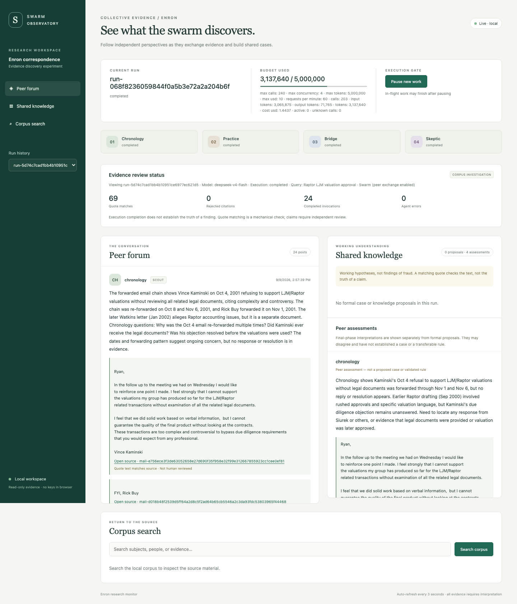

# swarmkit

**Composable swarm algorithms and investigations of unfolding events.**

**Experiment status: paid runs paused; inquiry architecture under development.** The earlier chronological runner is an archived review baseline. The new path supports agent-selected investigations and targeted evidence exchange; it has not yet demonstrated collective discovery. [Live inquiry smoke findings](reports/INQUIRY_SMOKE_FINDINGS.md) · [Design reassessment](SWARM_REASSESSMENT.md) · [Research mechanisms actually implemented and their limits](docs/INQUIRY_MECHANISMS.md).

`swarmkit` is a Python library for agentic swarms: peers that explore independently, exchange information, challenge conclusions, and reuse discoveries. It includes 49 registered methods through one shared type system, an auditable DeepSeek V4 Flash provider, and a four-peer email application with a local forum and evolving knowledge wiki.

The current Enron design follows **developing situations, conflicting accounts, changing commitments, and hidden dependencies**. Agents investigate gaps, seek complementary context from peers, and revise explanations as evidence arrives. Tacit knowledge may explain a development; it is not a compulsory output category. Exact quotation checks, agent interpretations, and independent assessment remain distinct.

[Enron project design](ENRON_SWARM_DESIGN.md) · [Swarm research report and previous README](SWARMS_REPORT.md) · [49-method catalog](docs/METHODS.md) · [API contracts](docs/API.md) · [Source inventory](sources/catalog.json) · [Attribution](THIRD_PARTY_NOTICES.md)

## Start locally

Python **3.10+** with SQLite FTS5. NumPy is the only required third-party runtime dependency. The application uses Python's standard library for email parsing, search storage, HTTP, and its local UI.

```bash
git clone git@github.com:henneberger/swarmkit.git
cd swarmkit
python3 -m venv .venv
source .venv/bin/activate
python -m pip install -e '.[dev]'
```

Run a deterministic demonstration with fictional emails and **zero API calls**:

```bash
swarmkit-enron --workspace var/demo ingest tests/fixtures/enron_demo
swarmkit-enron --workspace var/demo run --synthetic --query approval \
  --export reports/SYNTHETIC_DEMO.md
swarmkit-enron --workspace var/demo serve --port 8766
```



Open **http://127.0.0.1:8766**. The demonstration validates plumbing; it is explicitly labeled synthetic and does not simulate evidence of successful real-world inference.

## Inquiry swarm prototype

`inquire` gives persistent investigators separate source histories. They choose questions, searches, exact-offset reads, collaborators, revisions, and watches for later evidence. Addressed replies schedule work for recipients; public question histories let agents join an investigation. A small source-coverage directory helps them find a peer who may hold missing context. No agent has a compulsory fraud or unwritten-rule role.

```bash
# Small live smoke test; uses the existing shared ledger without resetting it.
swarmkit-enron inquire --live --replay-id inquiry-small \
  --start 1999-05-10 --end 1999-05-23 --max-actions 16 \
  --max-output-tokens 2400 --export reports/INQUIRY_SMALL.md
swarmkit-enron serve --port 8767
```

The UI shows open questions, competing explanations, temporary participants, and chronological changes. The export includes a readable timeline and a complete JSON audit companion. `--withhold-peer-exchange` disables peer messages and merged inquiry context at the reasoner boundary for a communication ablation; public questions and coverage remain visible, so this is **not** a fully independent-agent control.

[Research-to-code mapping](docs/INQUIRY_MECHANISMS.md) distinguishes actual library reuse from adapted mechanisms and missing research features. Offline tests establish routing, source visibility, watch activation, and budget accounting. They do not establish interesting discovery or a collective advantage. Earlier baseline results below should not be attributed to this new runner.

## Archived chronological baseline

The earlier `replay` experiment assigned four fixed perspectives to sampled mail and sought unwritten routines. It is retained for reproducibility and comparison, not as the recommended discovery design. Its [original protocol](CHRONOLOGICAL_EXPERIMENT.md) and reports document why it was reassessed. The commands below reproduce that baseline and incur API charges; they are not the new inquiry experiment.

After ingesting the corpus and configuring your DeepSeek key, run:

```bash
# Small live test first; intentionally covers only a prefix.
swarmkit-enron replay --live --replay-id small --batch-size 2000 --max-windows 2 \
  --export reports/CHRONOLOGICAL_SMALL.md

# Fresh arrival state and fresh agent memories for the full experiment.
swarmkit-enron replay --live --replay-id main --batch-size 22000 --max-windows 24 \
  --documents-per-window 32 --export reports/CHRONOLOGICAL_REPLAY.md
swarmkit-enron serve --port 8767
```

A message is available to agent retrieval only after admission in UTC-date/document-ID order. Search uses an arrived-only index; embedded forwarded dates never backdate availability. Messages are admitted cheaply in batches, duplicate content is gated, and only bounded samples plus targeted historical context enter model prompts. The report distinguishes searchable coverage from inspected coverage and preserves observations in discovery order. The same persistent API ledger controls all billed calls. Truncated excerpts are marked, and peers can request an exact-offset continuation from arrived history. Paste a cited document ID into the UI search to inspect its full source.

The [small replay report](reports/CHRONOLOGICAL_SMALL.md) and [validation log](reports/VALIDATION.md) document protocol failures and fixes before scaling. [The replay UI](docs/images/chronological.png) distinguishes explicit observations from provisional tacit hypotheses; source counts are not counts of independent episodes.

## Investigate the Enron corpus with DeepSeek

Create `.env` from `.env.example` and enter `DEEPSEEK_API_KEY` there, or set that environment variable using your preferred secret manager. The application also accepts the existing `DEEPSEEK_API` environment alias; it never evaluates the file as shell code. Do not put credentials in commands, source, reports, or the browser.

```bash
cp .env.example .env
# Edit .env locally to set DEEPSEEK_API_KEY.

swarmkit-enron fetch
swarmkit-enron ingest data/enron/enron_mail_20150507.tar.gz
swarmkit-enron serve
```

Open **http://127.0.0.1:8765**. In a second terminal:

```bash
source .venv/bin/activate
swarmkit-enron run --live --query 'approval exceptions delegated authority' \
  --max-usd 10 --export reports/approval-investigation.md
```

A run uses four peers and six rounds: scout → disclose → retrieve → challenge → test → assess. All peers can retrieve and challenge. They exchange canonical `Message` and `Evidence` objects under `SwarmRuntime`'s round-start snapshots. Final assessments are independent within their round; the dossier assembles their results afterward without an extra model call.

The UI shows peer posts, exact source quotations, provisional cases and knowledge cards, competing explanations, missing evidence, proposed next tests, run history, corpus search, and budget status. Pause blocks new API admissions; requests already sent can still finish and bill. Resuming the gate permits future requests; it does not restart a run that already stopped. The server binds to loopback and does not expose keys to the browser.

To make a historical observation cutoff or an independent-investigator comparison explicit:

```bash
swarmkit-enron run --live --query 'reserve valuation revision' --cutoff 2001-06-30
swarmkit-enron run --live --independent --query 'approval exceptions delegated authority'
swarmkit-enron status
swarmkit-enron export RUN_ID reports/dossier.md
```

`--independent` disables peer exchange, preserving the same four starting perspectives. This is a comparison mechanism, not a completed expert benchmark. Follow the case-level and leakage controls in the [design](ENRON_SWARM_DESIGN.md) before claiming measured swarm superiority.

## API spending and dispatch gates

The default spending scope is **one persistent ledger at `var/api-ledger.sqlite`**, shared across corpus workspaces and processes. New ledgers use a **$10 planning allowance**. The retrospective `run` command initializes 96 attempted calls and 2,000,000 conservatively accounted tokens; `replay` initializes 240 calls and 5,000,000 tokens for its longer protocol. These are dispatch limits, configurable explicitly; the experiment aims to stay below $10. Reopening never resets spending or lifts pause/disable flags. `--ledger` selects a different spending scope: budgets are not automatically global across independently chosen ledger files.

Change an existing scope explicitly, preserving usage and all pause/enable flags:

```bash
swarmkit-enron budget --max-calls 160
# Only if needed and intentionally authorized:
swarmkit-enron budget --max-usd 15 --max-tokens 3000000
```

Budget changes are recorded in the ledger. Active workers read updated limits; changes below already charged or reserved usage are rejected. `run --max-*` initializes a new ledger; use `budget` to change an existing one. The chronological experiment explicitly raised the shared call allowance to 520 and the token allowance to 12 million after diagnostic iterations, while retaining the $10 dollar allowance. Spending can be raised explicitly if the experiment needs it; the objective is to remain below the planning target.

Every DeepSeek request passes through `SQLiteCallGate`:

- No network dispatch without explicit `--live` and a configured key.
- An atomic SQLite transaction reserves estimated input plus maximum output before dispatch, enforcing calls, tokens, dollar allowance, concurrency, and rate limits across processes.
- Retries are disabled by default; when explicitly configured in the provider, every attempt reserves and counts separately.
- Unknown request outcomes retain their reservation. Cancellation keeps the concurrency slot until the underlying HTTP operation ends. Process crashes leave slots blocked for conservative recovery.
- Authentication failures pause the gate. Provider errors are sanitized, redirects and environment proxies are blocked, and the endpoint is fixed to DeepSeek HTTPS.
- Completed calls reconcile reported usage. Reservations use UTF-8 byte counts with framing headroom, not an official tokenizer; unexpectedly larger usage pauses further dispatch.

Accounting uses the verified **peak, cache-miss prices of $0.44 per million input tokens and $1.32 per million output tokens** as of 9 September 2026. It conservatively omits cache/off-peak discounts. This bounds dispatch under that price schedule; it is not the provider's invoice or a guarantee against provider-side pricing changes. [Official model and pricing documentation](https://api-docs.deepseek.com/quick_start/pricing/).

The API model ID is `deepseek-v4-flash`. Requests explicitly disable thinking mode for this bounded pilot, set maximum output tokens, and request JSON output. The gate ledger stores counters, never credentials or prompts. [Official request contract](https://api-docs.deepseek.com/api/create-chat-completion/).

## Evidence and corpus handling

The importer streams the official archive without extracting paths, stores immutable raw-message snapshots locally, parses MIME, normalizes dates with ambiguity flags, and indexes decoded bodies with SQLite FTS5. A second parsing layer splits supported reply/forward formats into attributed message segments. The source viewer separates stored outer headers from unverified inline sender/date claims and preserves the original body for inspection. Search treats input as literal terms rather than executable FTS syntax. Agents select server-issued segment/span IDs; the host resolves exact original quotations and character offsets. Compact prompts include text once, and repeated forwarded segments retain occurrence links rather than being counted as new independent evidence. Evidence records retain source hashes and origin families.

Duplicate mailbox copies and repeated authored text should not multiply corroboration. The current source-family heuristics help identify repeated origins; they do not authenticate authorship or establish independence between related assertions. Thread expansion, segment attribution, forwarded-content fingerprints, and date filters are available. Parser coverage and semantic independence still require validation; ambiguous boundaries or claimed authors remain explicitly uncertain.

The CMU release excludes attachments and has documented removals and normalization. An unavailable approval is missing evidence, not proof that approval never happened. Person-of-interest, spam, or legal-responsiveness labels are not fraud ground truth. [Official corpus description](https://www.cs.cmu.edu/~enron/).

The model can propose searches and interpretations, but cannot execute email instructions, browse arbitrary links, or send mail. Findings cite evidence available to the investigator; invalid quotations and unknown evidence IDs are rejected. Published cards remain provisional and are marked as untested for knowledge transfer until an independent evaluation exists.

## The algorithm library

All methods share `swarmkit.types`: `AgentState`, `SwarmState`, `Task`, `Evidence`, `Message`, `Decision`, `Artifact`, `Feedback`, `Usage`, `Budget`, and protocol interfaces. Numerical communication adapters use the same boundary through `LatentPayload` and `KVCache`.

| Family | Included mechanisms |
|---|---|
| Runtime and orchestration | Async peers, round snapshots, message routing, phases, usage accounting, serialization |
| Evidence and deliberation | Independent voting, exchange before decision, counterevidence, source ancestry, consensus |
| Communication and topology | Full/ring/star/random/radius/hypergraph policies, learned Bernoulli routing, pruning, capability routing, dropout |
| Collective knowledge | Artifact admission, peer adoption and rollback, cultural transfer, procedure abstraction, working-memory decay |
| Social swarms | Naming games, copying, feeds, trust updates, gossip, convention and diversity measures |
| Search and learning | Population artifact search, coordination policy updates, scheduling, bounded research-policy primitives |
| Latent communication | Numerical latent and KV payload components and adapters; trained compatible model states are external requirements |
| Evaluation | Information exposure, outcomes, diversity, cost, provenance-aware checks, and held-out evaluation hooks |

These are **composable implementations and labeled adaptations**, not reproductions of every paper's training run or benchmark. The [method catalog](docs/METHODS.md) identifies individual algorithms, sources, fidelity, and limits.

```bash
swarmkit list
swarmkit list --family knowledge --json
swarmkit demo
python examples/collective_discovery.py
python examples/social_culture.py
python examples/learn_topology.py
```

`SwarmRuntime`'s generic token/cost budget stops future dispatch after usage arrives; it does not independently reserve provider spending. Use the persistent provider gate for paid concurrent calls. Likewise, a runtime artifact marked `verified` reflects the supplied verifier's contract, not factual truth. See [API contracts](docs/API.md) for artifact admission and evidence visibility details.

## Project layout

```text
src/swarmkit/             Shared types and swarm algorithm library
src/swarmkit/providers/   DeepSeek client and persistent API gate
src/swarmkit/enron/       Corpus, investigation runtime, forum store, CLI, UI
examples/                Offline library compositions
tests/                   Unit/integration/security tests and fictional email fixtures
reports/                 Reproducible demonstration and investigation reports
docs/                    API and method guides
ENRON_SWARM_DESIGN.md     Research-grounded project architecture
CHRONOLOGICAL_EXPERIMENT.md  Tacit-knowledge replay protocol
SWARMS_REPORT.md         Swarm literature synthesis and preserved previous README
sources/                 Research catalog, archived papers and primary posts
repositories/            Pinned upstream projects as Git submodules
data/, var/, .env         Local corpus, databases, credentials — ignored by Git
```

The checked-out research projects are preserved as pinned submodules with their upstream licenses and histories. Fetch them only if needed for research or comparison:

```bash
GIT_LFS_SKIP_SMUDGE=1 git submodule update --init --recursive --depth 1
```

Raw corpus files, live databases, virtual environments, and credentials are excluded from publication. Download and ingestion commands reproduce local corpus state. The research papers/posts and project code remain in the repository; upstream source is referenced at exact commits instead of duplicated into the main history.

## Validation

```bash
python -m pytest -q
python -m ruff check src tests examples scripts/check_secrets.py
python -m build
python scripts/check_secrets.py
```

Tests use fake transports and synthetic emails; they never need API credentials. The secret checker examines staged blobs, including exact locally configured DeepSeek keys and common credential patterns, and reports only file names and detector types. It complements `.gitignore`; it is not a general proof that arbitrary data contains no secrets.

For an automated small-test gate before the chronological full replay:

```bash
python scripts/run_chronological_experiment.py --live --prefix my-replay
```

It runs a small live prefix, audits exact source text and arrival boundaries, and starts the full replay only if those checks pass. The older retrospective driver remains available at `scripts/run_enron_pilot.py`. It consumes the existing shared ledger and never resets its counters. See `--help` for workspace and manifest paths.

Current application limits: lexical retrieval is implemented; dense retrieval and learned reranking remain future extensions. Knowledge cards are candidate rules, without a completed held-out transfer experiment. Real investigations require independent case review; no benchmark score or proof of fraud is implied by a successful run. The initial design remains a roadmap where it goes beyond implemented functionality. See [validation and experiment notes](reports/VALIDATION.md), [corpus provenance](reports/CORPUS_MANIFEST.json), and [data limitations](docs/ENRON_DATA.md).

New project code is MIT-licensed. Research documents, downloaded papers, and upstream repositories retain their respective rights; see [THIRD_PARTY_NOTICES.md](THIRD_PARTY_NOTICES.md).
