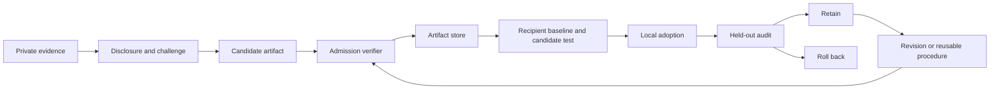
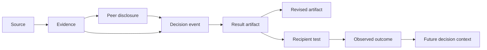

# SwarmKit

**Composable algorithms for agentic swarms and collective knowledge.**

SwarmKit is a Python library for building populations of agents that explore independently, exchange evidence, challenge conclusions, and reuse discoveries. It brings communication, deliberation, learning, and evaluation into one shared type system, so you can combine mechanisms and test what each contributes.

The library includes **49 registered methods**, a provider-neutral async runtime, deterministic offline examples, and an optional DeepSeek client with persistent spending controls. Python **3.10+** is required; **NumPy is the only required third-party runtime dependency**.

[Method catalog](docs/METHODS.md) · [API and composition guide](docs/API.md) · [Research background](SWARMS_REPORT.md) · [Attribution](THIRD_PARTY_NOTICES.md)

[Economic games research](docs/ECONOMIC_GAMES_RESEARCH.md) maps classical and modern game theory to proposed hypergraph-agent mechanisms, strategies, and evaluation methods. Its [downloaded source archive](sources/economic-games/README.md) includes papers, blog posts, pinned repository checkouts, and 26 implementation candidates; these extensions are research proposals, not registered methods yet.


**On this page:** [Goals](#goals-and-motivation) · [Feature tour](#feature-tour) · [Get started](#get-started) · [Knowledge management and context graphs](#knowledge-management-and-context-graphs) · [Benchmarks and evaluations](#swarm-benchmarks-and-evaluations) · [Economic games: when to use them](#economic-games-when-to-use-them) · [Extension points](#extending-swarmkit) · [Relevance](#why-it-is-relevant) · [Scope](#scope-and-research-fidelity) · [Development](#development-and-project-layout)

## Goals and motivation

The central question is: **when does interaction let a group discover or accomplish something its members would miss working independently?**

An agent may hold a useful observation that never reaches the person making a decision. Several agents may agree because they inherited the same mistaken source. A successful solution may disappear at the end of a run, or fail when another agent tries to reuse it. SwarmKit makes these situations explicit through private evidence, controlled communication, source ancestry, persistent artifacts, and local evaluation.

Its goals are to:

- **Make swarm mechanisms composable.** Change the communication graph, decision rule, memory policy, or learning procedure without rebuilding the surrounding experiment.
- **Make information flow inspectable.** Track who knew what, which evidence was shared, and where conclusions and artifacts came from.
- **Turn discoveries into reusable knowledge.** Preserve lineage, test an artifact before adopting it, and roll back adoption when its utility regresses.
- **Measure the value of collaboration.** Compare interacting agents with independent controls, account for work and cost, and evaluate transfer on held-out cases.
- **Connect research ideas to executable components.** Give each registered method an implementation, source attribution, and an explicit description of its fidelity and limits.

You supply the agents, tools, task-specific evaluators, and environment. SwarmKit supplies the mechanisms for organizing their interaction and examining the results.

## Feature tour

The tour covers all 49 registered entries, plus runtime, persistence, and provider integration. Each section describes the usable API, the problem it addresses, and its extension points. Paper and project references identify mechanisms or motivations; the [full catalog](docs/METHODS.md) records per-method fidelity and limitations.

### 1. Shared records make algorithms interchangeable

Every module uses the contracts in [`swarmkit.types`](src/swarmkit/types.py). A topology policy, deliberation method, and artifact store can participate in the same experiment without translating between competing agent or message formats.

| Contract | What you represent with it |
|---|---|
| `Task` | A question or job, optional candidate answers, and application metadata |
| `AgentState` | Identity, capabilities, private evidence, inbox, memory, beliefs, and activity state |
| `SwarmState` | The population, committed messages, artifacts, step counter, and seeded RNG |
| `Evidence` | A sourced claim, its owner, support/contradiction links, and parent evidence |
| `Message` | A sender, recipients, message kind, evidence, artifact references, and parent messages |
| `Decision` | An agent's answer, confidence, cited evidence IDs, and stated rationale |
| `Artifact` | A reusable result or procedure with author, content, evidence, and revision ancestry |
| `Feedback` | Evaluated utility, verification status, costs, and optional per-agent feedback |
| `AgentContext` / `AgentOutput` | Inputs to an agent turn and explicit messages, decisions, artifacts, usage, and memory updates |
| `AlgorithmResult` | Outputs and metrics from a synchronous algorithm or scheduled workload |
| `Usage` / `Budget` | Measured work and limits on calls, tokens, cost, and steps |
| `LatentPayload` / `KVCache` | Numerical communication with model/layer compatibility information |

The records describe your experiment. Task-specific meaning—what counts as a useful answer, authentic source, or valid procedure—comes from your application.

### 2. Compose offline algorithms or run async agents

[`Pipeline`](src/swarmkit/runtime.py) runs a sequence of `step(state, task)` algorithms, commits their messages and artifacts, and advances the step once per stage. Calling an algorithm's `step` directly lets you inspect outputs before committing them with `apply_result`; direct callers own the step increment.

`SwarmRuntime` runs agent callbacks in named phases with bounded concurrency. Each turn sees a round-start snapshot. Changes to a callback's context copy do not mutate authoritative state; `AgentOutput.memory_updates` is the explicit persistence path.

This complete offline runtime example broadcasts a note from each peer and then makes independent decisions from the next round's inbox:

```python
import asyncio
from swarmkit import (
    AgentOutput, AgentState, Budget, CallableAgent, Decision, Message,
    SwarmRuntime, SwarmState, Task,
)

async def act(context):
    if context.phase == "explore":
        return AgentOutput(
            messages=(Message(context.agent.id, "I can inspect a candidate."),),
            memory_updates={"explored": True},
        )
    return AgentOutput(decision=Decision(
        context.agent.id,
        "inspect",
        rationale=f"Received {len(context.messages)} peer messages.",
    ))

async def run():
    state = SwarmState({name: AgentState(name) for name in ("scout", "reviewer")})
    runtime = SwarmRuntime(
        state,
        {name: CallableAgent(act) for name in state.active_ids},
        concurrency=2,
        budget=Budget(max_calls=4),
    )
    result = await runtime.run(
        Task("inspection", "Choose the next action", candidates=("inspect",)),
        phases=("explore", "decide"),
    )
    print([decision.answer for decision in result.decisions])

asyncio.run(run())  # ['inspect', 'inspect']
```

Replace the callback body with your model or tool integration and return measured `Usage`. `CompletionAgent` is an alternative adapter for an async `complete(prompt: str) -> str` function; it requests structured decisions during `decide` and rejects unknown candidates or unavailable evidence IDs.

By default, valid peer outputs can commit even if another callback fails. `fail_fast=True` raises after dispatch completes and rolls back round output commits. External calls and their usage cannot be rolled back. The [runtime contracts](docs/API.md#connect-a-model-or-tool-backed-agent) explain cancellation and artifact admission.

### 3. Choose the communication graph

[`swarmkit.topology`](src/swarmkit/topology.py) separates who may communicate from what an agent says.

| API | Use it to explore |
|---|---|
| `FullTopology`, `RingTopology`, `StarTopology` | All-peer exchange, local propagation, or hub-mediated communication |
| `RandomTopology`, `LocalRadiusTopology` | Seeded sparse graphs or neighborhoods defined by agent positions |
| `HypergraphTopology` | Shared group membership and multilateral neighborhoods |
| `RoundDropoutTopology` | Round-specific node and edge masks |
| `BernoulliDAGPolicy` | Sample, learn, regularize, and prune directed communication edges |
| `DyLANSelection` | Select contributors using supplied importance scores and consensus stopping |
| `CapabilitySuccessRouter` | Route work using capability overlap and observed success |

`MessageBus` enforces topology for both addressed messages and broadcasts. Empty recipients mean broadcast to reachable active peers; senders do not receive their own broadcast. Message IDs are deduplicated, and conflicting ID reuse is rejected. A `recipient_filter` can further restrict delivery.

For example, this sends one observation around the first edge of a ring:

```python
from swarmkit import AgentState, Message, MessageBus, SwarmState
from swarmkit.topology import RingTopology

state = SwarmState({name: AgentState(name) for name in ("a", "b", "c")})
bus = MessageBus(topology=RingTopology(bidirectional=False))
bus.publish(state, Message("a", "New observation", id="observation-1"))
print({name: len(agent.inbox) for name, agent in state.agents.items()})  # a: 0, b: 1, c: 0
```

A communication graph is an exposure policy. An algorithm with its own shared board needs an explicit inbox mode for that graph to restrict information access.

Research connection: [GPTSwarm — Language Agents as Optimizable Graphs](https://arxiv.org/abs/2402.16823) and its [upstream project](https://github.com/metauto-ai/gptswarm) motivate treating connectivity as an optimization variable. SwarmKit adapts edge learning and pruning; it does not include GPTSwarm's full node-prompt optimization.

### 4. Share useful evidence and deliberate

Communication has two separate choices: whether to send information and how to use it in a decision.

| API | Behavior |
|---|---|
| `InformationGate` | Trigger messages from entropy or distribution changes, novelty, and a silence interval |
| `EvidenceCompressor` | Bound evidence-card count while retaining provenance and counterevidence |
| `GossipRelay` | Relay evidence through neighbors with bandwidth and lifetime limits |
| `IndependentVoting` | Produce decisions without exchanging private evidence |
| `ExchangeThenDecide` | Disclose evidence and objections before committing to answers |
| `CritiqueReviseDebate` | Run bounded candidate, critique, and revision callbacks |
| `WeightedConsensus` | Aggregate decisions and track stability |

`GossipRelay` freezes previous delivery state so a card cannot travel several edges in a single round. Compression limits cards, not tokens or bytes; configure provider budgets separately.

`ExchangeThenDecide` defaults to an all-peer evidence board. To study sparse communication, construct it with `ExchangeConfig(delivery="inbox")` and pass a topology-constrained bus to `Pipeline`. Allow enough rounds for evidence to travel through the chosen graph.

The [evidence-exchange example below](#a-small-evidence-exchange-experiment) shows a minority observation changing the group decision. Built-in symbolic scoring is useful for controlled fixtures; callback-based deliberation lets you supply richer reasoning. Agreement and confidence remain separate from external correctness checks.

Research connection: [HiddenBench — Systematic Failures in Collective Reasoning under Distributed Information in Multi-Agent LLMs](https://arxiv.org/abs/2505.11556) motivates explicit disclosure and private-information recovery. [Improving Factuality and Reasoning in Language Models through Multiagent Debate](https://arxiv.org/abs/2305.14325) informs the critique/revision component. These are adaptations and components, not reproductions of the papers' evaluations.

### 5. Manage knowledge from discovery through retirement

[`swarmkit.knowledge`](src/swarmkit/knowledge.py) treats reuse as a lifecycle with explicit tests and lineage.



| API | Role in the lifecycle |
|---|---|
| `EvidenceRegistry` | Validate evidence ancestry and resolve shared root sources |
| `ArtifactStore` | Verify admission, preserve immutable snapshots and lineage, retire obsolete artifacts |
| `PeerAdoption` | Compare recipient baseline and candidate utility, adopt a reference, then audit or roll back |
| `DecayingMemory` | Model forgetting and explicit refresh of retained knowledge |
| `CulturalTransfer` | Carry verified artifacts across generations and evaluate fresh recipients |
| `ProcedureAbstraction` | Generate reusable procedures and admit candidates using held-out evaluation |
| `StigmergicPolicy` | Discover and test shared artifacts using decaying success traces |

This executable fixture separates global admission from the recipient's local test:

```python
from swarmkit import AgentState, Artifact, Feedback, Task
from swarmkit.knowledge import ArtifactStore, PeerAdoption

# A tiny external fixture defines feasibility and measured local utility.
passable = {"A": False, "B": True}
store = ArtifactStore(lambda artifact: Feedback(
    utility=float(passable[artifact.content["route"]]),
    verified=passable[artifact.content["route"]],
))
artifact = store.admit(Artifact("route-b-v1", "scout", {"route": "B"}))

def evaluate(agent, candidate, task):
    route = "A" if candidate is None else candidate.content["route"]
    return Feedback(task.metadata["utility"][route], verified=True)

peer = AgentState("planner")
adoption = PeerAdoption(store, evaluate, minimum_gain=0.1)
trial = Task("trial", "Test local benefit", metadata={"utility": {"A": 0.2, "B": 0.9}})
holdout = Task("holdout", "Check retention", metadata={"utility": {"A": 0.2, "B": 0.8}})
assert adoption.adopt(peer, artifact.id, trial)
assert adoption.audit(peer, holdout)
print(peer.memory["adopted_artifact"])  # route-b-v1
print(store.lineage(artifact.id))        # ('route-b-v1',)
```

An adoption records a memory reference; your agent decides how to use it. A revision needs a new ID and `parents=(previous_id,)`. Retirement preserves history while excluding an artifact from future active adoption. The store is in-memory; durable storage is an application responsibility.

For the connection to organizational memory and context graphs, see [Knowledge management and context graphs](#knowledge-management-and-context-graphs).

Project connection: [Gensyn's collaborative-autoresearch demo](https://github.com/gensyn-ai/collaborative-autoresearch-demo) informs the pattern of discovering peer improvements and evaluating them locally before reuse. SwarmKit generalizes that pattern through artifact and evaluator interfaces; it does not run the upstream service.

### 6. Search over solutions and learn coordination

[`ParticleSwarmSearch`](src/swarmkit/optimization.py) maintains a population of artifact candidates, personal and global bests, failure history, and ancestry. You provide mutation and evaluation callbacks. The candidate can be a prompt, procedure, configuration, or numerical construction; the mutation callback defines what a meaningful change is for that domain.

[`swarmkit.learning`](src/swarmkit/learning.py) exposes smaller trainable pieces:

| API | What it learns or scores |
|---|---|
| `SoftmaxPolicy` | Categorical coordination choices with REINFORCE or clipped PPO updates |
| `CollaborativeReward` | Correctness plus measured improvement in peers, minus cost |
| `ParallelReward` | Completion and useful parallelism shaping with separate critical-path cost |
| `counterfactual_message_credit` | Leave-one-message-out contribution under a supplied evaluator |

`BernoulliDAGPolicy` learns who should communicate. A sampled graph stays fixed within a step, and its feedback is applied once. Pruning is permanent within the policy namespace; agent ordering defines allowable DAG direction.

Run the full feedback loop with:

```bash
python examples/learn_topology.py
```

The example rewards correct decisions from delivered evidence and penalizes unnecessary edges. These NumPy policies train coordination variables. Transformer training, task-specific reward validation, and model checkpoints belong to an external integration. Counterfactual message credit requires controlled evaluation and does not compute exact Shapley values.

Research connection: [SwarmAgentic: Towards Fully Automated Agentic System Generation via Swarm Intelligence](https://arxiv.org/abs/2506.15672) motivates population search with feedback-guided candidate evolution. SwarmKit supplies the search lifecycle; task-specific system generation remains an injected mutation function.

The collaborative reward adaptation is informed by [MAPoRL: Multi-Agent Post-Co-Training for Collaborative Large Language Models with Reinforcement Learning](https://arxiv.org/abs/2502.18439). Its multi-agent training objective motivates rewarding useful collaboration; SwarmKit provides small policy and reward primitives, not the paper's LLM co-training stack.

### 7. Schedule dependent work and measure parallelism

[`DAGExecutor`](src/swarmkit/scheduling.py) runs ready tasks concurrently. Declare dependencies in `Task.metadata["depends_on"]`; the worker receives completed direct dependencies in `metadata["dependency_results"]`. Failed jobs block descendants while independent branches continue.

```python
import asyncio
from swarmkit import AlgorithmResult, Task
from swarmkit.scheduling import DAGExecutor

async def worker(task):
    inputs = task.metadata["dependency_results"]
    return AlgorithmResult(metadata={"job": task.id, "inputs": tuple(inputs)})

async def run_jobs():
    jobs = [
        Task("inspect", "Inspect the candidate"),
        Task("measure", "Measure its performance"),
        Task("combine", "Combine observations", metadata={
            "depends_on": ("inspect", "measure"),
        }),
    ]
    result = await DAGExecutor(worker, concurrency=2).run(jobs)
    assert result.metrics["completed"] == 3
    print(result.metadata["results"]["combine"].metadata["inputs"])

asyncio.run(run_jobs())  # ('inspect', 'measure')
```

The executor validates missing dependencies and cycles before dispatch. Concurrency, timeout, and budget are configurable. Results report `critical_path_seconds` separately from `total_work_seconds`; `critical_path` is also available as a standalone function. Decomposition and worker behavior are your extension points.

Research connection: the parallel-agent training and critical-path perspective in [Kimi K2.5: Visual Agentic Intelligence](https://arxiv.org/abs/2602.02276) informs scheduling and parallel reward components. SwarmKit requires caller-supplied task decomposition and workers; it does not contain the trained orchestrator.

### 8. Explore social dynamics and collective memory

[`swarmkit.social`](src/swarmkit/social.py) provides mechanisms for studying what a population sees, copies, and retains.

| API | Experiment it supports |
|---|---|
| `NamingGame` | Convention formation through pairwise interactions, including committed minorities |
| `ProportionalCopying` | Adoption proportional to locally visible frequencies |
| `FeedPolicy` | Visibility ranked by recency, engagement, reputation, and diversity |
| `TrustNetwork` | Directional, domain-specific trust with bounded transitive paths |
| `GossipRelay` | Evidence diffusion through explicit local neighborhoods |

Combine these with `DecayingMemory` to examine retention or with provenance metrics to detect repeated origins. A popular label, high trust score, or stable convention does not validate a factual claim. The executable [`social_culture.py`](examples/social_culture.py) demonstrates visibility, copying, bounded relay, and maintenance using offline fixtures.

Research connection: [Emergent social conventions and collective bias in LLM populations](https://arxiv.org/abs/2410.08948) informs the naming-game adaptation. SwarmKit uses a symbolic choice policy for controlled experiments; it does not reproduce the paper's LLM population runs.

### 9. Exchange numerical state where models permit it

The numerical adapters in [`communication`](src/swarmkit/communication.py) and [`latent_training`](src/swarmkit/latent_training.py) operate on actual arrays supplied by your integration.

| API | Operation |
|---|---|
| `LatentMemory` | Bounded FIFO memory for compatible model/layer payloads |
| `GeometricAlignment` | Fit a centered/whitened Procrustes map from paired states |
| `VocabularyAnchor` | Blend mapped states with target-vocabulary neighbors |
| `LinearLatentCodec` | Fit a ridge reconstruction adapter |
| `KVCacheTranslator` | Learn separate feature maps for keys and values |
| `ContrastiveLatentCodec` | Train paired retrieval against mismatched negatives |
| `LatentBottleneck` | Compress and reconstruct through a PCA baseline |

Payloads can travel in `Message.metadata` and use the core JSON serializer. Calibration rows must correspond semantically; KV calibration requires aligned leading axes. Models, layers, shapes, and finite values are checked. SwarmKit does not extract hidden states from hosted text APIs or supply pretrained cross-model adapters. Reconstruction and retrieval scores need downstream task evaluation before you infer useful knowledge transfer.

Research connection: [Latent Collaboration in Multi-Agent Systems](https://arxiv.org/abs/2511.20639) motivates latent-memory components. SwarmKit exposes numerical payload and adapter contracts, with compatible model integration left to the caller. The [method catalog](docs/METHODS.md#latent) identifies the additional alignment and codec sources separately.

### 10. Measure collective benefit with explicit controls

[`swarmkit.evaluation`](src/swarmkit/evaluation.py) separates several questions that a single consensus score cannot answer.

| API | Question |
|---|---|
| `private_evidence_recovery` | How much initially private evidence reached recipients? |
| `ancestry_adjusted_agreement` | How much agreement remains after accounting for shared evidence roots? |
| `population_diversity` | How varied are the population's labels? |
| `interaction_reciprocity` | How many directed interaction edges are reciprocated? |
| `hyperedge_irreducibility` | What is the higher-order degree-inequality structure of group interactions? |
| `transfer_gain` | How does utility change on paired recipient cases? |
| `matched_independent_control` | Does interaction help under matched initial inputs and total work budget? |

`matched_independent_control` copies initial inputs, divides the declared total budget across isolated agents, invokes your interacting and independent runners, and compares them using the same scoring callback. Runners must honor the budget and match tools and external information access. Use a fresh initial state before disclosure to avoid giving the control information from the interacting run.

For a defensible experiment, define an external outcome, choose the work-budget unit, hold evaluation cases out of discovery, and repeat over independent populations or tasks. Agents within one interacting run are not independent experimental replications. Structural diversity, message volume, and higher-order interaction metrics are diagnostics, not measures of intelligence.

Research connection: [Debate or Vote: Which Yields Better Decisions in Multi-Agent Large Language Models?](https://arxiv.org/abs/2508.17536) motivates treating independent aggregation as an explicit baseline when evaluating discussion. SwarmKit supplies comparison utilities; outcomes depend on your tasks, agents, budgets, and scoring.

### 11. Checkpoint state and control paid dispatch

[`swarmkit.serialization`](src/swarmkit/serialization.py) saves shared dataclasses, mappings, sets, tuples, numerical arrays, and RNG state as JSON:

```python
from pathlib import Path
from tempfile import TemporaryDirectory
from swarmkit import AgentState, SwarmState
from swarmkit.serialization import load, save

state = SwarmState({"scout": AgentState("scout")}, seed=7)
with TemporaryDirectory() as directory:
    path = Path(directory) / "state.json"
    save(state, path)
    restored = load(path)
    assert restored.rng.getstate() == state.rng.getstate()
```

Unsupported objects fail explicitly. A snapshot contains private population state; it does not serialize every external policy, artifact store, model, verifier, or service. Preserve those separately for a complete experiment restart.

The optional [`DeepSeekClient` and `SQLiteCallGate`](src/swarmkit/providers/deepseek.py) add provider-level accounting. A gate transaction reserves estimated input and maximum output before each dispatch and enforces call, token, estimated-spending, concurrency, and rate limits across processes using the same ledger. Reopening a ledger preserves usage and pause/enable flags. Completed requests reconcile usage; unknown outcomes retain conservative reservations. Retries, if configured, count as separate attempts.

The generic runtime's token and cost limits use returned usage and stop future dispatch after it arrives. For paid concurrent calls, enforce reservations at the provider boundary. The DeepSeek integration supplies that boundary for its client; other provider callbacks must implement their own. Applications own credential configuration and deliberate enablement of live calls.


## Get started

Install from a checkout:

```bash
git clone git@github.com:henneberger/swarmkit.git
cd swarmkit
python3 -m venv .venv
source .venv/bin/activate
python -m pip install -e .
```

The distribution is named `swarmkit-research`; Python imports and the library CLI use `swarmkit`.

Run an offline demonstration and browse the registry:

```bash
swarmkit demo
swarmkit list
swarmkit list --family knowledge --json
```

No API credentials or network calls are needed for these commands.

### A small evidence-exchange experiment

Three agents share an old map. Only one has a new survey. Compare their independent decisions with decisions after evidence exchange:

```python
from swarmkit import AgentState, Evidence, Pipeline, SwarmState, Task
from swarmkit.deliberation import (
    ExchangeThenDecide,
    IndependentVoting,
    WeightedConsensus,
)

shared = Evidence(
    "old-map", "Old map recommends A", "map", "planner",
    supports=("A",), confidence=0.4,
)
survey = Evidence(
    "new-survey", "A is closed; B is passable", "survey", "scout",
    supports=("B",), contradicts=("A",),
)
state = SwarmState(
    {
        name: AgentState(
            name,
            private_evidence=(shared, survey) if name == "scout" else (shared,),
        )
        for name in ("planner", "scout", "reviewer")
    },
    seed=7,
)
task = Task("route", "Choose the currently passable route", candidates=("A", "B"))
consensus = WeightedConsensus()

before = IndependentVoting().step(state, task)
exchange = ExchangeThenDecide()
after = Pipeline([exchange, exchange, exchange]).step(state, task)

print(consensus.aggregate(before.decisions, task).metadata["winner"])  # A
print(consensus.aggregate(after.decisions, task).metadata["winner"])   # B
```

This fixture uses symbolic evidence scoring. It demonstrates the information-flow mechanism; it does not establish model performance or a general advantage for swarms.

Continue with executable compositions:

| Example | What it demonstrates |
|---|---|
| [Collective discovery](examples/collective_discovery.py) | Private evidence → exchange → verified artifact → local adoption |
| [Social culture](examples/social_culture.py) | Convention formation, ranked visibility, evidence relay, and memory maintenance |
| [Learn topology](examples/learn_topology.py) | Feedback-driven communication graph learning and pruning |

The [API guide](docs/API.md) covers model callbacks, topology-constrained delivery, artifact verification, latent payloads, and checkpoints.

## Knowledge management and context graphs

### From individual observations to organizational memory

Knowledge management asks how experience becomes available beyond the person or team that acquired it. Nonaka's *A Dynamic Theory of Organizational Knowledge Creation* describes organizational knowledge creation through interaction between tacit and explicit knowledge and across individual and organizational levels. That provides a useful conceptual lens for SwarmKit's disclosure, artifact creation, and recipient evaluation; the library does not implement or validate the full organizational theory. [Nonaka, 1994 — paper](https://doi.org/10.1287/orsc.5.1.14).

In a SwarmKit application, a useful result can move through several distinct stages:

| Knowledge-management concern | SwarmKit mechanism | Application responsibility |
|---|---|---|
| Capture experience | `Evidence`, `Message`, and `Artifact` records | Extract observations from real work and attach reliable source identifiers |
| Make knowledge available | Topology, disclosure, gossip, artifact discovery | Decide which recipients may access which sources |
| Preserve origin and revision history | Evidence parents, artifact parents, authorship, `ArtifactStore.lineage` | Maintain stable identities and durable storage |
| Establish applicability | Admission verification and `PeerAdoption` local evaluation | Define valid checks and representative recipient cases |
| Retain or revise knowledge | Memory refresh, adoption audits, rollback, retirement | Detect changed conditions and schedule re-evaluation |
| Generalize experience | `ProcedureAbstraction` and `CulturalTransfer` | Supply candidate generation and genuinely held-out tasks |

For example, an incident-response application could turn a successful diagnostic sequence into an artifact, retain the observations that justified it, test it on a second service, and retire it after a platform change. This is a possible composition of library components, not a bundled incident-management product.

Context engineering addresses a related operational question: which information should an agent receive for its next action? Anthropic's *Effective context engineering for AI agents* discusses selective retrieval, compaction, structured note-taking, and multi-agent architectures. SwarmKit's message gates, bounded evidence cards, explicit memory, and dependency handoffs provide mechanisms for experimenting with that selection. This is a conceptual connection; SwarmKit does not bundle Anthropic's infrastructure. [Anthropic — engineering blog](https://www.anthropic.com/engineering/effective-context-engineering-for-ai-agents).

### Connect decisions to the context that justified them

Here, **context graph** refers to a connected record of decision events, supporting context, and subsequent outcomes. Gupta and Garg describe context graphs as accumulated decision traces that connect entities and events over time, making precedents, exceptions, and approvals retrievable. Their article is an industry thesis that motivates this use case, rather than experimental evidence for SwarmKit. [Gupta and Garg — *AI's trillion-dollar opportunity: Context graphs*, Foundation Capital](https://foundationcapital.com/ideas/context-graphs-ais-trillion-dollar-opportunity).

SwarmKit already has useful relationships for constructing such a record:

| Relationship | Existing representation |
|---|---|
| Agent observed a sourced claim | `Evidence.owner`, `Evidence.source`, and private evidence |
| Claim derives from earlier claims | `Evidence.parents` |
| Message shares evidence or references a result | `Message.evidence`, `Message.artifact_ids`, `Message.parents` |
| Decision cites its basis | `Decision.agent_id`, `Decision.evidence_ids`, `Decision.rationale` |
| Result has an author and supporting evidence | `Artifact.author`, `Artifact.evidence` |
| Result revises or combines earlier results | `Artifact.parents` and store lineage |
| Recipient uses a tested result | The adoption reference in agent memory and application-recorded feedback |

A context-graph integration could connect these records as follows:



This diagram is an **application schema**, not an automatically maintained graph in the core library. `Decision` has no built-in event ID, timestamp, or automatic link to a resulting artifact. An application must assign event identities, associate tasks and rounds with decisions, persist tool results and evaluation outcomes, and link the resulting artifacts. Approval records, temporal entity resolution, graph storage/query, and access control are also application responsibilities. The core has typed records and ancestry checks; it has no built-in context-graph database or PROV exporter.

The W3C PROV family supplies a reference vocabulary for provenance across entities, activities, and responsible agents. It is useful when designing an external mapping from SwarmKit sources, execution events, and artifacts into a persistent provenance system. SwarmKit's records are not a claim of PROV conformance. [W3C — PROV Overview](https://www.w3.org/TR/prov-overview/).

The communication graph and the context graph serve different purposes: the first controls which peers exchange information during execution; the second preserves relationships among evidence, decisions, and outcomes for later inspection and reuse. An application can use the latter to retrieve relevant precedents for a future swarm task. Retaining a stated rationale documents what an agent reported; external observations and checks are still needed to establish what happened and whether the decision worked.

## Swarm benchmarks and evaluations

**To experiment with communication strategies, start with [Evaluating swarm communication](docs/COMMUNICATION_EVALUATION.md).** It covers routing, timing, message contents and compression; controls that separate communication gains from extra computation; outcome and cost measurements; and existing shared-state paths that affect experiments. It includes a small proposed pilot and [downloaded foundational papers](sources/communication-evaluation/README.md). This is research guidance, not a new benchmark implementation.

Use the [benchmark research review](docs/BENCHMARK_RESEARCH.md) and [evaluation suite specification](docs/BENCHMARK_SUITE.md) when designing experiments to determine **whether a collective mechanism improves useful outcomes at a known cost**. The review covers current multi-agent benchmarks, realistic workflow and coding tasks, decentralized coordination, strategic interaction, and continual learning. It includes code-level grading limitations that matter when interpreting published results.

The suite specifies eight primary tracks:

| Use this track when testing… | What must be verified |
|---|---|
| Distributed evidence and computation | Correct integration of information held by different agents |
| Joint artifact construction | Component changes work together in the final artifact |
| Heterogeneous tool workflows | Delegation across roles produces the required final system state |
| Dynamic execution and recovery | Agents handle changing events, failed tools and incomplete work |
| Decentralized coordination and contention | Shared resources and simultaneous contributions produce feasible progress |
| Economic and strategic interaction | Allocations, delivered work and payoffs remain valid across partner strategies |
| Collective exploration and discovery | Shared experiments produce independently verified findings |
| Persistent learning and transfer | Reused knowledge improves held-out tasks and adapts to change |

Each specification defines a scenario, scaling axes, verifier, controls, failure modes and integration path. Compare task success, resource use and robustness separately. A no-message condition still permits indirect communication if agents share files or environment state; a full-information single-agent condition changes access and must be labeled accordingly. Puzzles are optional microdiagnostics rather than the organizing principle of the suite.

**Status:** this is completed research and a proposed evaluation specification. Runnable environment adapters and generators are not implemented or registered. Existing utilities in [`swarmkit.evaluation`](src/swarmkit/evaluation.py) remain available for paired controls, evidence recovery and transfer measurements.

The [source archive](sources/benchmarks/README.md) contains 16 paper downloads, seven pinned Git checkouts, a [repository audit](sources/benchmarks/repository-audit.md), and [machine-readable specifications](sources/benchmarks/suite-spec.json). Read the research review for distinctions between published claims, inspected code, and our proposed adaptations.

## Economic games: when to use them

Use economic-game models when agents' choices depend on **scarce resources, different objectives, private information, or the behavior of other agents**. They let you study who should do a task, what information an agent chooses to share, how a team divides rewards, and whether a strategy remains effective against unfamiliar partners.

**Status:** the [economic-games research guide](docs/ECONOMIC_GAMES_RESEARCH.md) describes proposed extensions. Its 26 candidates are not included in the library's 49 registered methods. SwarmKit already supplies agent records, group communication, execution, feedback, and artifact verification; economic game state, private valuations, contracts, and settlement still need implementation.

### Choose a model for the problem

The following are proposed applications and experiment starting points. The research guide records their sources, assumptions, and limits.

| When your swarm needs to… | Models to explore | Strategies or controls to compare |
|---|---|---|
| Assign work among agents with different costs and capabilities | Contract Net, reverse auctions, stable matching | Fixed assignment, capability routing, cost bids, preference-based assignment |
| Compete for limited tool calls, compute, or reviewer time | Auctions and congestion games | Truthful-reference bids, shaded bids, random legal bids, adaptive routing |
| Complete a task requiring several complementary specialists | Threshold coalition games and combinatorial auctions | Individual assignments, team bids, conditional participation, coalition entry/exit |
| Negotiate price, quality, deadlines, or disclosure | Bargaining and alternating-offer protocols | Fixed offers, deadline concessions, reciprocal concessions, structured LLM offers |
| Sustain costly contributions to shared evidence or reusable artifacts | Public-goods and repeated games | Free riding, unconditional contribution, reciprocity, forgiveness, contribution thresholds |
| Attribute the value of a joint result and share its reward | Coalition values, Shapley estimation, core diagnostics | Equal shares, marginal-contribution estimates, negotiated shares; check coalition stability separately |
| Aggregate forecasts about later independently verified outcomes | Scoring rules and prediction markets | Independent forecasts, budget-limited trades, calibration and outcome-resolution controls |
| Learn strategies that work against changing partners | Regret learning, PSRO, evolutionary evaluation | Fixed policies, adaptive policies, mixed populations, held-out partner cross-play |
| Explore learned incentives or very large populations | Learned auctions, two-level institutions, multi-type mean-field learning | Exact small-game baselines, fixed incentive rules, explicit small populations |

### When the hypergraph matters

Use an economic hyperedge when a **whole group's joint choices** determine an outcome. For example, a research task may require a scout, an analyst, and a reviewer before its artifact has value. A team bid can represent that complementarity, while a shared effort budget prevents an agent from promising the same capacity to multiple teams.

The current `HypergraphTopology` controls which peers can communicate through shared groups. The proposed economic layer would preserve each group's identity, roles, action rules, payoffs, and settlement history. Overlapping groups also require joint resource checks: two contracts cannot independently spend the same agent balance.

For a first experiment, compare fixed assignment and capability routing with team procurement on a task that requires all three specialists. Verify the delivered artifact, account for actual execution costs, and measure team success and each participant's utility. Add negotiated reward sharing or learned bidding only after the basic allocation and settlement behavior is testable.

If all agents share one objective and the question is simply who receives evidence or which task runs next, start with the existing topology, deliberation, and scheduling APIs. Introduce economic models when incentives or strategic responses are part of the question. A game-theoretic mechanism's guarantees depend on its assumptions; fluent negotiation or high simulated profit alone does not establish better task outcomes.

### Research materials and implementation planning

- [Research guide](docs/ECONOMIC_GAMES_RESEARCH.md): classical foundations, modern techniques, proposed Python interfaces, staged build order, and acceptance experiments.
- [Source library](sources/economic-games/README.md): 25 downloaded PDFs, five blog posts, and 14 pinned Git checkouts, with download and extraction limitations recorded.
- [Candidate catalog](sources/economic-games/method-candidates.json): 26 proposed components with strategies, assumptions, metrics, and source IDs.
- [Repository audit](sources/economic-games/repository-audit.md): inspected code paths and suitability for optional adapters or research reference.

## Extending SwarmKit

Start with the narrowest interface that matches your integration. Implementations remain ordinary Python code:

| Extension point | Contract |
|---|---|
| Agent | `act(AgentContext) -> AgentOutput`, async, or wrapped by `CallableAgent` |
| Synchronous algorithm | `step(SwarmState, Task) -> AlgorithmResult` |
| Communication topology | `neighbors(SwarmState, sender) -> Sequence[str]` |
| Artifact verifier | `Artifact -> Feedback` |
| Adoption evaluator | `(AgentState, Artifact or None, Task) -> Feedback`; `None` evaluates baseline behavior |
| Search mutation | `(current, personal_best, global_best, failures, rng) -> Artifact` |
| Search evaluator | `Artifact -> Feedback` |
| Procedure proposer | `tuple[Artifact, ...] -> Artifact`, paired with an `(Artifact, Task) -> Feedback` evaluator |
| Scheduled worker | Async `Task -> AlgorithmResult` |

Algorithm instances can hold state outside `SwarmState`; other mechanisms bind state to a task ID or namespace. For independent experiments, use fresh populations and stores and reset or replace the relevant policies. JSON serialization preserves supported population data, not an entire configured deployment.

Use `swarmkit.methods()` to inspect registry metadata and `swarmkit.resolve(name)` to obtain a registered implementation. Resolution returns the class or callable; you supply its constructor arguments. The CLI's `list --json` exposes sources, fidelity labels, and limitations for programmatic inspection.


## Why it is relevant

SwarmKit is useful when **information, exploration, or experience is distributed across agents**, and you need to understand whether connecting them improves the result.

For an application developer, it provides interchangeable pieces for evidence-sharing assistants, collaborative search, and tested reuse of solutions. For a researcher, it provides common contracts for comparing communication graphs, disclosure rules, memory, social influence, and independent baselines. For someone exploring swarm methods, its small offline examples make mechanisms accessible before adding model behavior and API costs.

For knowledge-management applications, these mechanisms help preserve the basis of a discovery and test whether it remains useful to another recipient. For context-graph applications, the typed records provide inputs to a durable history of evidence, decisions, and reuse, while your application supplies event capture and graph persistence.

The practical benefit is an experiment you can change and inspect: hold the task and initial evidence fixed, vary how agents communicate, and measure which information reaches a decision, what gets reused, and what the interaction costs.

## Scope and research fidelity

SwarmKit is a research library. Its registered entries include primitives, mechanisms, components, adaptations, baselines, designs, and metrics. They do not reproduce every source paper's training setup or benchmark results. The [method catalog](docs/METHODS.md) records the distinction for each entry.

A `verified` artifact has passed the supplied verifier's contract. Source ancestry depends on the source identifiers you provide. Consensus measures agreement. Meaningful claims about correctness or collective benefit require suitable external checks, held-out evaluation, and independent experimental runs.

The Enron investigation application, corpus tooling, UI, and experiment records now live in the separate [Enron project](https://github.com/henneberger/enron), checked out locally at `~/enron`.

## Development and project layout

```bash
python -m pip install -e '.[dev]'
python -m pytest -q
python -m ruff check src tests examples scripts/check_secrets.py
python -m build
python scripts/check_secrets.py
```

Tests use synthetic fixtures and fake provider transports; API credentials are not required.

| Path | Contents |
|---|---|
| `src/swarmkit/` | Shared contracts, runtime, algorithm modules, and registry |
| `src/swarmkit/providers/` | Optional provider integration and persistent call gate |
| `examples/` | Offline library compositions |
| `tests/` | Unit and integration tests |
| `docs/` | Method catalog, API contracts, and application documentation |
| `sources/`, `repositories/` | Research inventory and pinned upstream Git submodules |
| `sources/economic-games/` | Economic-game papers, posts, provenance records, candidate catalog, and separate Git-ignored research checkouts |
| `sources/benchmarks/` | Benchmark research, source provenance, repository audits and eight evaluation specifications |

Research submodules are optional for library use. To fetch them for comparison:

```bash
GIT_LFS_SKIP_SMUDGE=1 git submodule update --init --recursive --depth 1
```

The economic-games checkouts use their own collector rather than the submodule command. To download the collection or reconstruct missing checkouts at their recorded commits, run the following from the project root; collection requires network access and `pdftotext` for PDF extraction. The verification command checks local source hashes and repository commits.

```bash
python3 scripts/collect_economic_games.py
python3 scripts/collect_economic_games.py --verify
```

The benchmark research archive uses the same collection and verification workflow:

```bash
python3 scripts/collect_benchmarks.py
python3 scripts/collect_benchmarks.py --verify
```

New project code is [MIT-licensed](LICENSE). Research documents and upstream projects retain their respective rights; see [THIRD_PARTY_NOTICES.md](THIRD_PARTY_NOTICES.md).
