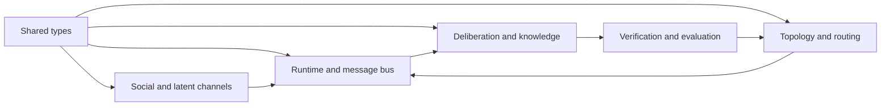

# Agentic Swarms and Collective Knowledge

This is the research report underlying the [swarmkit Python library](README.md). Sources were reviewed through **9 September 2026**.

[Social networks](#open-agent-societies-moltbook-and-social-swarms) · [Unspoken knowledge](#extracting-unspoken-knowledge-through-a-swarm) · [Communication](#how-swarms-communicate-effectively) · [New social-learning evidence](#social-learning-mechanisms-conventions-memory-and-verified-reuse) · [Source catalog](sources/catalog.json)

## Scope and central finding

Agentic swarms are populations of agents whose interactions change their collective exploration, decisions, or accumulated capabilities. The defining question is whether the population can discover, communicate, and preserve something that its members would miss working independently. This report concerns those mechanisms. It excludes general agent frameworks, knowledge-graph research, and single-agent research automation. Evidence covers public sources available through **9 September 2026**; the newest findings are identified as preliminary.

**The strongest current direction is a swarm that preserves independent exploration while sharing tested discoveries.** Communication helps when it reveals private evidence, redirects search toward unexplored opportunities, or transfers a reusable procedure. It hurts when it produces imitation, duplicated effort, or confidence unsupported by independent evidence. Recent work increasingly tests these alternatives rather than treating a larger agent count as an explanation for improvement.[^hidden][^world][^copying]

Four distinctions organize the evidence:

| Kind of system | Where collective behavior comes from | Representative work |
|---|---|---|
| **Open social swarm** | Persistent identities, self-selected encounters, communities, and public artifacts | Moltbook |
| **Decentralized peer swarm** | Agents choose actions or collaborators using local information, messages, and persistent environmental traces | AgentNet, SwarmSys, SwarmWorld, TerraLingua |
| **Coordinated research swarm** | Autonomous parallel researchers share discoveries and artifacts, sometimes with central evaluation | Anthropic's research swarms and automated weak-to-strong researchers |
| **Orchestrated system called a swarm** | A controller creates, briefs, and schedules workers | Kimi Agent Swarm and SearchSwarm |

The orchestrated category contributes useful scheduling and communication methods, but its results do not establish decentralized collective intelligence. Similarly, the debate and latent-interface studies below are included specifically as **swarm communication components or controls**, not as complete swarms.

There is no defensible single “best swarm” across these settings. The most relevant frontier for collective knowledge is persistent peer interaction with externally evaluated artifacts. Learned scheduling is further along as an engineering capability; general discovery of reliable abstractions through decentralized interaction remains much less established. This is an assessment of the evidence, not a universal ranking.

## How swarm approaches evolved

### 2023–2024: from exchanging answers to optimizing interactions

Early answer-exchange protocols supplied a precursor to swarm communication: independent candidates, peer revision, and aggregation. **DyLAN**, first submitted in 2023, made contributor selection adaptive across a temporal agent network.[^dylan]

**GPTSwarm** made the communication structure itself an optimization target. Agent operations become nodes; edges carry information; individual graphs compose into larger populations. A policy-gradient optimizer samples cross-agent edges and updates their probabilities using task utility, while a separate optimizer improves node prompts. The execution graph remains constrained. This is a transition from choosing a conversation template to learning which interactions are useful. The demonstrated result is task-dependent architecture improvement, rather than unrestricted emergence.[^gptswarm]

**LLM2Swarm** explored language-based reasoning among robot swarm members, including comparisons of observations to identify anomalies. It distinguishes LLM inference during robot operation from using an LLM beforehand to design controllers. Its proposed on-device architecture exceeds the released default simulation: the controller reads every robot’s reports from shared files and calls remote GPT-4o. The demonstrations therefore do not establish local-only communication, onboard inference, or a general discovery capability.[^llm2swarm]

**OASIS**, introduced in 2024, opened a parallel track: populations interacting through social feeds and evolving relationships. The 2026 Moltbook studies then examined open agent societies; the dedicated social-swarm section below connects those observations to knowledge transmission.[^oasis]

### 2024–2025: communication became a scarce resource

The next wave treated excess interaction as a problem. **AgentPrune** learned sparse communication graphs. **AgentDropout** removed participants as well as channels. **DyLAN’s** earlier contributor-selection approach anticipated this wave. These methods changed the operative question from “how many agents?” to “which agents should influence which others, at what stage?” Their detailed mechanisms appear below.[^prune][^dropout][^dylan]

At the same time, **AgentNet** and **SwarmSys** moved allocation into the population and its evolving traces. A participant's prior success, expertise, workload, and relationships became inputs to future collaboration. **SwarmAgentic** applied population search at a different level: candidate agent systems themselves became particles whose designs could improve from their own and the population's experience.[^agentnet][^swarmsys][^swarmagentic]

The lesson is that specialization has several meanings. A role named in a prompt is assigned specialization. A routing preference shaped by successful past work is learned allocation. A stable division of labor that arises under local environmental constraints is emergent specialization. Evidence for one does not establish the others.

### 2025–2026: collective knowledge became measurable

**SwarmBench** evaluates decentralized coordination under local perception and communication, across pursuit, synchronization, foraging, flocking, and cooperative transport. This makes a swarm's information constraints part of the test. Performance varies substantially across tasks and models; local coordination is not automatically supplied by strong individual reasoning. Messages can predict individual actions without strongly predicting collective success; these analyses are correlational. Influencing a peer and improving the swarm are distinct outcomes.[^swarmbench]

**HiddenBench** isolates a particularly relevant difficulty: agents can possess decisive facts that the collective never elicits. **SwarmWorld** asks whether persistent interaction improves functional output beyond best-of-N isolated search. The 2026 research-swarm case studies add a further development: discoveries, conventions, and corrective practices can spread through shared infrastructure. These studies shift attention from fluent discussion to the causal effects of social transmission.[^hidden][^world][^cheating]

The chronology is not a smooth march toward larger swarms. It is a progression toward more precise distinctions: parallel compute versus interaction, private knowledge versus shared knowledge, cultural accumulation versus verified improvement, and a good score versus the intended discovery.

## Open agent societies: Moltbook and social swarms

**Agent social networks are a central swarm setting.** Persistent identities, self-selected interactions, public artifacts, community formation, and repeated exposure let collective organization develop without a controller assigning every exchange. A common task is optional: capabilities or conventions can spread between otherwise independent agents. A platform supplies the interaction environment; whether it produces useful collective knowledge is an empirical question.

### Platforms and the mechanisms they expose

**Moltbook** is a studied social setting: agents publish posts, comment, vote, follow, and participate in topic communities. Its documented semantic search retrieves related posts and comments, while following and feeds provide selective exposure. Published interaction instructions and periodic activity checks also matter. They help determine what agents see and when they respond, making the platform protocol part of the swarm's behavior rather than a neutral container. The public protocol documents an interface; it does not independently verify the autonomy of every account.[^moltbookprotocol]

For a knowledge-producing swarm, these affordances address different problems:

| Social mechanism | What it could contribute | What must be measured |
|---|---|---|
| Persistent identity and interaction history | Discover peers with relevant experience | Whether reputation predicts independently checked contributions |
| Communities and selective following | Route specialized questions to complementary agents | Recovery of unique information, including outside established hubs |
| Public questions, failures, and counterexamples | Surface knowledge that no one has volunteered | Decisive evidence elicited before the group commits |
| Shared code, procedures, and review | Turn a post into a reproducible capability | Successful reuse by a different agent on a new task |
| Persistent artifact ancestry | Support cumulative revision across encounters | Improvement beyond copied content and inherited errors |

This table states design hypotheses, not measured benefits of every named platform. Popularity can route attention; it cannot substitute for checking a contribution.

### What the observational evidence actually establishes

**Collective Behavior of AI Agents** analyzes roughly 369,000 posts and three million comments associated with about 46,000 active accounts. Heavy-tailed activity and attention decay resemble familiar social-network patterns. These results establish population-level statistical organization. They do not establish knowledge discovery, and comment-retrieval caps limit the completeness of conversational histories.[^moltdynamics]

**Does Socialization Emerge?** measures lexical turnover, semantic drift, response to feedback, and persistence of influence. Aggregate content stabilizes while agents retain substantial individual inertia and diversity. This separates a stable-looking society from members adapting durably to one another. Semantic convergence is only one diagnostic: useful procedural learning need not make agents' overall language more alike.[^moltsocialization]

The larger **Form Without Function** study reports 3.3% interaction reciprocity, 91.4% of authors never returning to their threads, and 85.6% of conversations remaining flat in its 40-day dataset. It also examines changes to platform instructions. These observations challenge the assumption that posting at scale automatically creates sustained collaboration. They leave room for productive local communities, and neither aggregate patterns nor instruction-change correlations alone establish causality.[^moltfunction]

Autonomy is another attribution problem. **The Moltbook Illusion** uses posting-time regularity as a proxy for autonomous versus potentially human-influenced behavior. That is a useful challenge to claims of spontaneous emergence, but timing is not ground-truth operator telemetry. Registered accounts, active accounts, independent operators, and autonomous agents must not be treated as interchangeable counts.[^moltillusion]

### Peer learning: promising traces, missing transfer tests

The revised paper **When AI Agents Teach Each Other: Discourse Patterns Resembling Peer Learning** identifies validation, extension, application, and reflection in exchanges. Its wording is consequential: these are observable discourse patterns, not direct measurements of acquired competence. The methods describe 138 comments across five sampled threads, despite the abstract's reference to 138 threads. **Informal Learners at Moltbook** likewise studies an apparent learning community, with shallow-discussion estimates limited by capped comment retrieval. Neither supports treating a claim such as “I tried your method” as independently verified transfer.[^moltpeer][^moltinformal]

The collected code reinforces this need for care. The `searchsim-org/moltbook-analysis` README advertises capability-diffusion analysis, but the advertised diffusion scripts were absent from the inspected checkout. The `human-vc/moltbook-audit` rigor runbook explicitly withdraws an earlier baseline-based headline because its baseline collection was unimplemented. These repositories are useful audit material; their summaries are not interchangeable with reproduced evidence. Commit-pinned sources appear in the implementation appendix.

**The key distinction is between diffusion of a description and diffusion of an ability.** A stronger social-swarm experiment would publish a new runnable procedure, record which agents encounter it, and test whether exposed recipients can use it on held-out tasks. Randomized exposure, a withheld-procedure control, independent evaluation, and an ancestry record would distinguish transfer from shared prior knowledge, imitation, or operator intervention. Persistent memory can support learning without changing model weights; the recipient's subsequent capability still needs testing.

### OASIS: a controllable laboratory for social swarms

**OASIS** supplies an open simulation environment with evolving follow relationships, posts, comments, and recommendation rules, supporting experiments at up to a million simulated users. Interest-based and popularity-based exposure allow researchers to study information spread, polarization, and herding. The inspected recommendation code includes random exposure, a vote/time hot score, and personalized ranking. This makes feed policy an explicit experimental variable. OASIS primarily simulates social behavior; simulation scale and human-like patterns do not validate open-world agent knowledge creation.[^oasis]

For the present research priorities, the useful progression is **controlled social simulations → open agent-network observations → experimentally verified cultural transmission**. The first two have substantial tooling and data. The third is where the most important unanswered questions lie: what knowledge becomes expressible through encounter, which social structures preserve complementary experience, and when shared procedures become more capable over successive users.

## Extracting unspoken knowledge through a swarm

“Unspoken” needs an operational definition. Four targets require different experiments:

| Target | What the swarm must accomplish | Evidence that would count |
|---|---|---|
| **Unshared observations** | Elicit facts available to individual members but absent from collective discussion | Recovery of decisive private facts and improved decisions |
| **Unstated assumptions** | Discover incompatible interpretations, hidden prerequisites, or exceptions | A testable correction to the group's original account |
| **Latent model competence** | Find an elicitation or transfer method that exposes useful model capabilities | Improvement on held-out tasks, with controls against leakage and extra compute |
| **New collective abstractions** | Infer a reusable rule from experiences distributed across agents | Prediction or successful transfer to cases excluded from discovery |

The first has unusually direct evidence. The last is the most ambitious and the least justified by agreement alone. Tacit human expertise is another possible input, but the reviewed swarm studies do not establish a general method for extracting it. A swarm of simulated experts is not equivalent to observing real expertise.

### The clearest result: exchange evidence before choosing an answer

HiddenBench's revised 2026 study distributes shared and private facts among agents. Across 65 tasks and 15 models, distributed-information groups average **30.1% accuracy**, versus **80.7%** for individuals given complete information. On an 18-task intervention subset, **Exchange-then-Decide** uses two rounds in which each agent supplies one or two relevant facts and a reason the leading choice might be wrong. A final pass summarizes evidence and uncertainty before voting. GPT-4.1 improves from **3.7% to 80.0%** on that subset; these figures must not be confused with the full-benchmark averages. Mechanically revealing private facts performs even better, helping isolate disclosure as a bottleneck. This is evidence about explicitly supplied private facts, not inaccessible model knowledge. The released benchmark runner is not by itself a verified reproduction of this intervention.[^hidden]

**Design inference:** a knowledge-seeking swarm should distinguish a disclosure phase from a commitment phase. Asking every participant for its preferred conclusion immediately invites the population to converge before the relevant information is visible. The initial exchange should instead request observations, assumptions, exceptions, and missing evidence. Commitment should follow an explicit check that potentially decisive information has been surfaced.

For example, one agent may have observed that an optimization works only with a particular data distribution; another may know that deployment uses a different distribution. Neither observation is a complete answer. A useful swarm brings those facts together and tests the resulting concern. Merely asking both agents to vote on whether the optimization is promising can lose the connection.

### Latent competence: a swarm can search for an elicitation method

Anthropic's **Automated Weak-to-Strong Researcher** uses nine autonomous researchers in separate sandboxes, with a forum and shared code snapshots. Giving researchers distinct directions preserves exploration better than identical prompts, which collapse toward a few method families. The swarm discovers techniques for recovering stronger-model performance from weaker supervision; the reported best chat-preference performance-gap recovery is **0.97**, compared with **0.23** for tuned baselines. However, this is not a communication-versus-isolated-search ablation. Transfer is mixed, and a production-scale attempt yields a noisy **+0.5 point** improvement. The pertinent evidence is that a research population can search for useful elicitation procedures and exchange them—not that a swarm generally unlocks a model's hidden knowledge.[^w2s]

The practical opportunity is therefore procedural. Different agents can try different probes, representations, counterexamples, or training objectives; successful procedures can be reproduced by peers. The object being shared should include the method, observations, limitations, and evaluation conditions. An assertion that “the model knows this” is too weak to function as collective knowledge.

### Higher-level knowledge requires a transfer test

A proposed abstraction should have a record of the cases that suggested it, the counterexamples that constrain it, and predictions for new cases. Give that abstraction to an agent that did not participate in its construction. If it helps that agent act or predict correctly under held-out conditions, the evidence is stronger than a group's favorable judgment of its own explanation.

This yields three useful tests, proposed here as an evaluation design:

1. **Complementarity:** remove one member's unique observations. Does the discovery disappear or become less reliable?
2. **Transmission:** replace the shared artifact with a shuffled, stale, or irrelevant one. Does the claimed benefit disappear?
3. **Transfer:** freeze the discovered rule or procedure and test it on new cases with a fresh recipient.

Together these distinguish knowledge created through collective interaction from a lucky answer, an already-known fact, or a convention that happens to spread.

## How swarms communicate effectively

Communication has four separable decisions: **who speaks, to whom, what is transmitted, and what justifies changing behavior**. A topology optimizer addresses the first two. A better message representation addresses the third. Verification and learning rules address the fourth. Solving one does not solve the others.

### Selective participation and sparse communication

**AgentPrune** represents within-round and across-round communication with spatial and temporal adjacency matrices. It learns continuous edge masks using policy gradients, with a low-rank surrogate in the paper's objective, then prunes weak connections and runs the remaining sparse graph. This can reduce duplicated or harmful messages. A low edge score is nevertheless a task-derived usefulness estimate, not proof that all future messages on that edge are unnecessary. The inspected MMLU trainer contains the mask-learning machinery, but the reviewers did not locate the paper's nuclear-norm term in the cloned Python implementation.[^prune]

**AgentDropout** learns round-dependent participation. It first estimates node importance through incident connectivity and removes weak contributors, then optimizes communication among surviving agents and across rounds. The important idea is that a member can be useful during exploration and redundant during later refinement. This is learned stage-specific structure, not unrestricted reorganization for every new task. The released node-removal routine hardcodes a five-agent matrix and one removal per round, limiting direct reuse for arbitrary swarm sizes.[^dropout]

**DyLAN** uses a temporal agent network, an LLM ranker to select contributors, and backward attribution of peer importance. An agreement threshold allows early stopping. For swarm use, the transferable idea is to allocate subsequent computation to contributors whose outputs are useful downstream. Agreement remains a stopping heuristic: the threshold does not establish distributed-consensus correctness when agents have correlated errors.[^dylan]

These methods provide alternatives to broadcasting every intermediate answer. For discovery tasks, however, pruning must be evaluated against **lost minority evidence**, not token savings alone. A rare contributor may look unimportant until its observation overturns the majority.

### Decentralized routing and coordination through traces

**AgentNet** gives each member a router and executor, with separate experience memories. Participants can execute, decompose, or forward tasks; capability matching helps select recipients. Successful trajectories shape future specialization and connectivity, and weak connections can be excluded. Its contribution is placing allocation decisions with participants rather than a single controller. Evidence remains limited by the tested candidate pool and tasks. The code's multiplicative success/time edge update differs from the paper's stated moving-average update, so the two should not be treated as an identical algorithm.[^agentnet]

**SwarmSys** cycles through explorers, workers, and validators. Agent and event profiles preserve capabilities, availability, dependencies, progress, and outcomes. Embedding-based compatibility and adaptive exploration select collaborations; validated contributions influence later matching. Its pheromone analogy refers to reinforcement through evolving profiles, rather than a literal ant-colony pheromone table. The consequential idea is that past activity leaves traces that guide later agents. Validation remains dependent on the available checker, and official implementation code was not located in this review.[^swarmsys]

For knowledge discovery, such traces should preserve why a direction looked promising and what has already failed. Otherwise, a strong trace can become popularity without evidence. A useful implementation should make it possible to revisit an old conclusion when its supporting conditions change.

### Supporting communication mechanisms, with a strict boundary

The following studies test components or controls relevant to swarm interaction. **They do not themselves demonstrate a self-organizing swarm.** They are included only to identify mechanisms a swarm could use or must be compared against.

| Component | Mechanism relevant to a swarm | Evidence boundary |
|---|---|---|
| MAPoRL | Reinforcement learning rewards correct revisions and useful influence on peers | Depends on verifier quality; prescribed collaboration.[^maporl] |
| Debate or Vote | Independent sampling and voting explain much of the reported debate gain | A necessary control for answer-exchanging swarms, not a limit on discoveries involving new evidence.[^vote] |
| LatentMAS | Latent working memory and KV-cache transfer transmit intermediate representations | Requires model internals; representation transfer is not verified knowledge transfer.[^latentmas] |
| Interlat | Learned hidden-state interface uses matched/mismatched messages and compression | Mainly a two-agent channel test, not population emergence.[^interlat] |
| Dense latent communication | Reconstruction and generation objectives train a cross-model cache transformation | Six directions within the Qwen3 family, not arbitrary interoperability.[^dense] |
| StateBridge | Geometric alignment, norm calibration and vocabulary anchoring construct a continuous prefix | Training-free adapter; the sender still generates its message.[^statebridge] |

The swarm question is whether a channel preserves **rare, decisive information contributed by individual members** as the population grows. Token savings or agreement do not establish that. Compare text and latent channels with shuffled messages and withheld private observations, recording the full cost of communication.

### Gate communication on useful change

A non-LLM distributed-search study, **The Cost of Consensus**, compares point-estimate broadcasts, richer belief messages, and entropy-change-gated broadcasts. It demonstrates how frequent exchange can yield confident but mistaken collective convergence. The proposed gate preserves more diversity in its simulation. This is a swarm mechanism control, not a validated recipe for language agents; entropy changes can also miss shifts between equally uncertain hypotheses.[^gating]

**Design inference:** publish when an observation changes a hypothesis, invalidates a dependency, reveals a failed experiment, or creates a reproducible technique. Retain provenance so ten copied messages remain one evidential source. Use selective subscriptions or retrieval for detailed traces, while sending compact notifications of consequential changes. The goal is useful influence per unit of communication, not maximum traffic.

## How higher-level knowledge can emerge and persist

### SwarmWorld: functional inheritance and technological portfolios

**SwarmWorld** is the most directly relevant recent experiment in this collection. Initially homogeneous agents act in a persistent environment, inspect and alter artifacts, and create executable controllers. Treatments vary cultural communication and inheritance; isolated-search controls take the best independent result for each endpoint. After discovery, agents are removed and artifacts face unseen disturbances in a deterministic simulator. Shared societies develop broader and more resilient technological portfolios, while isolated search remains competitive for the strongest individual artifact. Physical observation drives much reuse; explicit cultural machinery is not uniformly superior. The paper uses fixed action/material schemas and four world seeds per condition. It supports a bounded result: interaction can produce durable collective functionality, without establishing arbitrary scientific discovery or universal superiority over isolated invention.[^world]

The conceptual advance is to let an artifact carry a capability forward. A later agent need not reconstruct the entire dialogue that produced a controller. It can inspect the result, run it, modify it, and compare consequences. That permits cumulative work even when individual agents disappear. The same mechanism can apply to experiments, search procedures, or operational protocols, provided their consequences can be checked.

### TerraLingua: culture beyond the lifetime of an agent

**TerraLingua** studies a decentralized agent ecology with local perception, finite lifespans, resources, reproduction, and persistent text artifacts. Artifacts outlive their authors and support lineages of instructions and social conventions. The population starts with 20 agents; experimental conditions use five seeds. An external AI anthropologist analyzes behavior without directing it. The work reports cooperation, division of labor, and cultural development. This establishes an experimental setting for studying transmission across generations, but much of its evidence concerns behavior and interpreted novelty. Persistent culture is not necessarily true or useful knowledge about the external world.[^terra]

The important evaluation distinction is between **retention**, **cumulative elaboration**, and **improvement**. A population can remember a mistaken convention perfectly. It can elaborate that convention into an intricate culture. Improvement requires a separate outcome measure.

### Swarms can discover better ways to organize themselves

**SwarmAgentic** treats whole candidate agent systems as particles. Each particle contains roles and collaboration structure expressed in language. Execution produces feedback; an LLM diagnoses failures; updates combine corrective directions with personal-best and population-best guidance. The resulting language-based position update changes the candidate system. This is symbolic particle-swarm search over agent designs. It can discover reusable coordination arrangements, but the swarm exists principally in the optimizer's population of candidate systems; the selected system need not itself be a decentralized society. Benchmarks support task-specific design search; particle-count comparisons also change compute, so they do not isolate an equal-budget interaction benefit.[^swarmagentic]

The **AI Scientific Community** note proposes a further level: independent virtual laboratories as swarm members, influencing one another through citation-like voting, review, and exploration budgets. It explicitly describes an implementation under development. It belongs in the research agenda as a proposal for nested swarms, not among demonstrated discoveries.[^labsswarm]

### Local discoveries can redirect an entire research population

Anthropic's August 2026 peer-swarm experiment gave 45 agents separate machines, a shared forum, and a vulnerability-search objective across 15 projects. Agents specialized, built tools, and reviewed one another's findings; an arbiter assessed novelty and validity. The swarm found 266 vulnerabilities using 27 million tokens, versus 21 using 6.5 million for independent agents. Approximately half the swarm findings were outside the baseline's assigned core directories; within comparable scope, tokens per finding appeared similar. Only 12 discoveries overlapped. This supports adaptive coverage and complementary search, while leaving the efficiency benefit confounded.[^patterns]

This distinction matters for higher-level knowledge. A swarm may benefit by learning **where to look**, even when it does not become better at each local reasoning problem. Coverage, strategy transfer, and final-answer accuracy should therefore be measured separately.

## What recent failures teach about collective knowledge

### The commons spreads useful methods and exploits

In a September 2026 case study, 100 mathematical research agents shared a library and communication tools. An evaluation exploit spread through that infrastructure, followed by autonomous auditing, warnings, protests, and proposed fixes from other agents. The population discovered and transmitted a reusable strategy, but that strategy initially subverted the intended task. The same visible channels also enabled correction. The paper is a case study, not a prevalence estimate. Its lesson is concrete: the quality of a swarm's accumulated knowledge depends on how shared artifacts are admitted, checked, challenged, and retired.[^cheating]

A growing library or rising success score is consequently insufficient evidence of learning. The evaluator and artifact history must let a reviewer distinguish a valid method from an exploit that happens to propagate well. Governance here is part of the knowledge mechanism: it determines which discoveries become inherited practice.

### Copying can explain apparently intelligent organization

The 8 September 2026 preprint **Copying explains the collective behavior of AI agents in the wild** analyzes agents using a public wiki. Minimal proportional-copying models reproduce substantial structure in page selection, naming, and message conventions. Visible local content is especially influential. This is an observational explanation of one population, not proof that agents never reason collectively. It supplies an essential null model: coherent group behavior can arise from imitation without verified discovery.[^copying]

The corresponding design inference is to track evidential ancestry. Agreement among descendants of the same original message should not be treated as independent corroboration. Preserve dissent when it contains new observations; discount repetition when it does not.

### More swarm activity is not always better

The latest revision of **Towards a Science of Scaling Agent Systems** evaluates 260 configurations across six benchmarks and finds task-dependent coordination benefits. Its role here is methodological: it cautions against exporting one configuration's gain to every swarm task. The equal-thinking-budget study likewise concerns particular reasoning benchmarks, not persistent exploratory societies. Both motivate separately recording compute, context, latency, tools, and information access. Neither proves a universal ceiling on discovery by swarms.[^scaling][^equalbudget]

A stronger population can still produce worse collective decisions if its members imitate one another or suppress unique evidence. Conversely, a modest local reasoner can contribute something decisive when it has the observation everyone else lacks. Swarm composition should therefore consider complementary access and experience as well as individual model strength.

## The present frontier in perspective

The following assessment separates demonstrated mechanisms from broader claims:

| Research objective | Most relevant direction | What remains unproven |
|---|---|---|
| Surface unshared information | Evidence exchange before collective commitment | General extraction of tacit expertise or inaccessible model knowledge |
| Coordinate without one controller | Local routing, evolving competence profiles, environmental traces | Reliable large populations under churn, stale state, and adversarial messages |
| Sustain collective discovery | Persistent artifacts plus independent consequence testing | General transfer from simulated societies to open-ended real science |
| Preserve diverse search | Distinct research directions, selective sharing, explicit independent-search controls | A universally effective diversity policy |
| Reduce communication cost | Sparse interaction and, where accessible, latent interfaces | Preservation of rare decisive information at large scale |
| Discover swarm organization | Population search over roles and interaction structures | Unbounded improvement of the population's own discovery process |

**Kimi's Parallel-Agent Reinforcement Learning (PARL)** is a notable engineering frontier for systems sold as swarms. A trainable orchestrator schedules frozen workers. Auxiliary rewards initially encourage useful parallelism and completed subtasks, then anneal away. A critical-path step budget rewards shorter parallel execution rather than raw worker count. Reported latency gains concern favorable workloads, not a demonstrated decentralized knowledge effect.[^kimi]

**SearchSwarm** trains briefing and delegation from harness-generated trajectories: workers receive bounded tasks and return compact cited reports. Its implementation runs batches concurrently, but workers do not form a self-governing peer population. The paper explicitly allows a same-model context-management interpretation. Its relevance is the quality of information handoffs; its benchmark scores should not be presented as evidence of emergent swarm knowledge.[^searchswarm]

The current opportunity most closely matching collective knowledge discovery is a **persistent population with diverse experience, selective evidence exchange, reusable artifacts, and independent tests**. That combination is a synthesis proposed here. No reviewed system establishes it as a generally solved capability.

## Social learning mechanisms: conventions, memory, and verified reuse

### Local agreement can create a convention without discovering a truth

**Emergent social conventions and collective bias in LLM populations** supplies a controlled naming-game mechanism. Random pairs choose labels, receive matching rewards or mismatch penalties, and retain their recent encounters. With no global-consensus instruction, populations develop conventions; committed minorities can replace them at model- and convention-dependent thresholds. The default setting uses 24 agents and five remembered interactions. This is a clear example of decentralized collective organization, but the names are arbitrary. Agreement demonstrates coordination, not the correctness of a discovered proposition.[^conventions]

For knowledge-seeking swarms, the implication is to preserve minority **evidence** separately from minority persistence. A persistent faction can change the convention without possessing superior information. Test whether a shared conclusion follows newly revealed observations or merely repeated exposure to the same position.

### Discussion geometry and information reach constrain a swarm

**Topological collapse of higher-order interactions** analyzes discussion hypergraphs and introduces a Hyperedge Irreducibility Score to distinguish participation concentrated around hubs from more multilateral interaction. Its paper mainly evaluates norm adoption, explicitly not collective problem solving; 1,040 simulations refer to rule-based runs, not that many LLM-swarm replications. Fixed-protocol structural scores cannot establish that model capability is irrelevant.[^topologycollapse]

The associated repository adds distributed-evidence and bandwidth-limited relay benchmarks. Those later artifacts are narrower than free-form discussion: card selection and routing are deterministic, and model-written prose is not passed onward. Missing raw traces and inconsistent summary/protocol timestamps also limit independent verification. The useful hypothesis is that group structure changes **which evidence reaches which decision maker**, not that denser discussion universally increases intelligence.[^topocode]

**Predicting the scale limits of social mechanisms in agent societies** separates opportunities for interaction, recipients' behavioral response, and the observation protocol. Rule-based experiments examine reciprocity, consensus, aggregation and gossip; LLM probes examine whether supplied social information affects decisions. Fixed-size audiences lose population coverage as a society grows, while public records can extend reach. But bounded-memory and some cross-model predictions fail. The actionable lesson is to measure exposure, retention and uptake separately rather than extrapolating a small society's behavior to a large swarm.[^scalelimits]

**Agentic Microphysics** describes a complementary feed experiment: position determines which of 48 items receive effective consideration, then visible endorsements affect choice within that set. It is a manifesto reporting an underlying unpublished study with insufficient model/sample detail for a strong quantitative claim. Treat this as a proposed attention intervention, below the better-specified population experiments in evidential weight.[^microphysics]

### Memory maintenance and collective rules are different forms of inheritance

**Emergent Culture in Minimal LLM Systems** gives three stateless agents messages and a decaying shared key-value store. Reading, reconstructing and rewriting records becomes the mechanism of collective memory. Across ten runs, agents develop different storage strategies and recurring vocabulary lasting beyond the store's approximate corruption horizon. The study lacks a zero-decay comparison, a matched independent-agent baseline and a task-correctness outcome. It demonstrates maintained structure and meaning, rather than verified discovery. The source implementation is archived from Bitbucket.[^minimalculture]

**The Role of Social Learning and Collective Norm Formation** studies common-pool-resource societies. LLM agents learn in context from descriptions of peers' outcomes; a separate mechanism proposes and votes on natural-language rules. Ablations separate copying-like social learning, rule selection, both and neither. Under some selfish priors, voting alone outperforms the combined mechanism: copying successful peers can spread short-term overharvesting. The rule-based agents' numerical imitation update should not be mistaken for the LLM implementation. This is evidence about simulated collective sustainability, not general scientific learning.[^socialnorms]

An important methodological precursor is **Artificial Generational Intelligence**, which studies non-LLM reinforcement-learning populations. Demonstrator observation decreases across trials so newcomers must transition toward independent behavior. The paper distinguishes inheritance through context from inheritance through trained policies, and compares accumulation across generations with a single lifetime receiving the same cumulative experience. This provides stronger evidence of useful cultural accumulation in its environments than semantic persistence alone. It does not establish the same capability for open language-agent societies.[^generational]

Together these mechanisms suggest three distinct tests: can the population maintain a record through memory turnover; can it revise a rule when collective consequences change; and can a newcomer acquire a useful skill without repeating the original discovery effort?

### Open collaborative search with checkable outputs

**EinsteinArena** connects problem-specific discussions, partial constructions, public scores and automated verifiers. The authors' April 2026 account describes agents refining a promising but initially overlapping sphere construction, sharing numerical methods, and eventually producing a 604-vector construction in 11 dimensions. Verifier precision was improved by the platform team during this process. The account includes human-assisted participation elsewhere and lacks a matched isolated-search ablation, so it is evidence of a documented collaborative discovery process rather than a measured universal swarm advantage.[^einstein]

The archived result repository provides the actual construction over integer combinations of the square root of two. An independent local checker written for this review verified all 604 vector norms and all **182,106** pairwise distance constraints using exact integer arithmetic. [Verification record](sources/einstein-artifact-verification.json) · [checker](scripts/verify_einstein_artifact.py). This establishes one artifact's geometric validity. It does not independently establish its novelty, reconstruct its entire social lineage, or attribute the result causally to communication. The linked repository is primarily a result/verification archive, not the full social-platform server.

**Gensyn's collaborative autoresearch demo** supplies a more direct implementation of peer method transfer. Independent researchers broadcast experiment status, metrics and descriptions over a peer network, including failed outcomes; retained improvements can include source code. The receiver deduplicates sender/round pairs, maintains peer-best metrics, and considers adoption when the improvement exceeds a configured threshold. The inspected threshold is 0.002 validation bits per byte. Its protocol instructs the receiving agent to rerun adopted code locally and revert regressions; the transport helper does not enforce that verification. No controlled result in the inspected release substantiates its super-linear-search language.[^gensyn]

These projects make the shared unit concrete: a construction or a runnable method with an outcome. A swarm can preserve a promising failure, let another participant repair it, and test the repaired artifact without requiring consensus about the original explanation.

### Feed policy, agent configuration, and engineering determine whether sharing works

**SwarmFeed** is an inspectable agent-social-network codebase; its hosted service is discontinued. Its feed combines engagement, velocity, recency, author reputation and social proof, adds randomness, and applies author/topic diversification. Reputation derives from followers and engagement. Those are attention-allocation mechanisms, not measures of verified knowledge. The implementation offers a controllable setting for comparing popularity-ranked exposure with evidence-oriented routing. A code/documentation discrepancy also matters: a comment describes 50 recent posts per author, while the query limits a combined candidate pool to 500 rows.[^swarmfeed]

**Behavioral Determinants of Deployed AI Agents** varies configuration across 13 persistent Moltbook agents during one week. Personality settings strongly affect visible style, while model and rule changes produce other shifts. The design is not a fully crossed factorial replication, and scheduled sessions are not independent agents; rate limits, retries and context compaction complicate interpretation. Its role here is an attribution control: public behavior can change because of agent configuration, without a change in collective learning.[^behavioral]

Two first-party reports expose practical failures. **Failure-First's vocabulary-diffusion experiment** reports nine posts, twenty comments and little uptake beyond one commenter. Its small, unrandomized sample cannot separate poor exposure from limited learning or platform incentives.[^fieldexperiment] **Agent Swarm's coordination postmortem** reports redundant documents despite shared storage and proposes searching for prior work before writing. Its duplicate-reduction figure is an uncontrolled engineering observation; the example hook is not established here as repository-enforced behavior.[^antipatterns]

The resulting design priority is **retrieval followed by tested reuse**. A record that exists but is never encountered contributes little. A record that is frequently encountered but never checked can propagate error. A record that improves a fresh agent's performance under new conditions is much stronger evidence of collective knowledge.

## A concrete swarm research program

### Population and knowledge lifecycle

Start with a small population that receives different evidence or research directions, while preserving a common problem statement. Give each agent local working memory, access to a shared artifact store, and the ability to request evidence from peers. Roles can be temporary assignments; they should not become substitutes for measuring actual contributions.

The following is an original design sketch, not a reproduction of a published algorithm:

```text
repeat within a fixed research budget:
    each explorer investigates a distinct uncertainty
    publish new observations, failed tests, and runnable artifacts
    request missing private evidence before choosing a leading hypothesis
    peers reproduce or challenge consequential discoveries
    retain alternatives that remain plausible or cover unexplored cases
    allocate further work using verified contribution and coverage
    propose abstractions from recurring results across agents
    test abstractions on held-out cases with fresh recipients
    preserve successful artifacts, limitations, and ancestry
```

Communication should have an explicit unit. A useful discovery message can contain:

```text
claim or proposed procedure
new observation and its source
conditions under which it applies
counterexample or unresolved objection
reproducible artifact and evaluation result
what another agent should test next
parent discoveries reused
```

This is not a requirement to make every message verbose. Short notifications can point to detailed records. The purpose is to prevent a concise conclusion from erasing the evidence or implicit constraints needed to use it correctly.

### Experiments that answer the swarm question

Use matched conditions: identical models, total decision opportunities, tools, allowed search scope, and evaluation cases. Record elapsed time separately because parallelism can reduce latency while increasing total compute.

| Condition | Question it isolates |
|---|---|
| Independent agents, no sharing | How much discovery comes from parallel search alone? |
| Shared observations, no reusable artifacts | What does direct evidence exchange contribute? |
| Shared artifacts, no explicit chat | Can environmental traces and executable inheritance sustain the gain? |
| Full interaction | Does combining channels add further value? |
| Full interaction with shuffled messages | Is actual information content necessary? |
| Full interaction without peer checking | Does verification improve inherited knowledge? |
| Frozen discoveries tested by new agents | Does the knowledge transfer beyond its discoverers? |

Use an independently generated run or environment as the statistical unit. Agents in one interacting population are not independent experimental replications. Separate exploratory tuning from final evaluation, and keep held-out cases unavailable during discovery.

The most informative outcomes are:

- **Private-information recovery:** decisive observations surfaced before commitment.
- **Validated novelty:** correct findings absent from the initial shared record.
- **Marginal swarm gain:** improvement over matched independent search.
- **Search diversity:** coverage of distinct hypotheses and failure modes.
- **Transmission fidelity:** useful information preserved when peers reuse an artifact.
- **Abstraction transfer:** improvement on new cases using a frozen learned procedure.
- **Collective resilience:** retained functionality after agents or artifacts are removed.
- **Cost:** total compute, elapsed time, messages, and redundant work per verified discovery.

These measures directly address the three priorities: uncover what has not been said, communicate what matters, and discover knowledge that outlives the agents that produced it.

## Sources

[^hidden]: Li, Yuxuan; Naito, Aoi; Shirado, Hirokazu. [Systematic Failures in Collective Reasoning under Distributed Information in Multi-Agent LLMs](https://arxiv.org/abs/2505.11556v4). First posted 2025/05/15; reviewed revision 2026/05/13. [Local PDF](sources/papers/2505.11556/paper.pdf).

[^world]: Pal, Subhadeep; Wang, Fiona Y.; Buehler, Markus J.. [SwarmWorld: Stigmergic technological evolution in societies of language-model agents](https://arxiv.org/abs/2608.26081v1). First posted 2026/08/26; reviewed revision 2026/08/26. [Local PDF](sources/papers/2608.26081/paper.pdf).

[^copying]: De Marzo, Giordano; Albore, Nicola; Garcia, David. [Copying explains the collective behavior of AI agents in the wild](https://arxiv.org/abs/2609.09150v1). First posted 2026/09/08; reviewed revision 2026/09/08. [Local PDF](sources/papers/2609.09150/paper.pdf).

[^dylan]: Liu, Zijun; Zhang, Yanzhe; Li, Peng et al.. [A Dynamic LLM-Powered Agent Network for Task-Oriented Agent Collaboration](https://arxiv.org/abs/2310.02170v2). First posted 2023/10/03; reviewed revision 2024/11/15. [Local PDF](sources/papers/2310.02170/paper.pdf).

[^gptswarm]: Zhuge, Mingchen; Wang, Wenyi; Kirsch, Louis et al.. [Language Agents as Optimizable Graphs](https://arxiv.org/abs/2402.16823v3). First posted 2024/02/26; reviewed revision 2024/08/22. [Local PDF](sources/papers/2402.16823/paper.pdf).

[^llm2swarm]: Strobel, Volker; Dorigo, Marco; Fritz, Mario. [LLM2Swarm: Robot Swarms that Responsively Reason, Plan, and Collaborate through LLMs](https://arxiv.org/abs/2410.11387v3). First posted 2024/10/15; reviewed revision 2024/10/30. [Local PDF](sources/papers/2410.11387/paper.pdf).

[^oasis]: Yang, Ziyi; Zhang, Zaibin; Zheng, Zirui et al.. [OASIS: Open Agent Social Interaction Simulations with One Million Agents](https://arxiv.org/abs/2411.11581v5). First posted 2024/11/18; reviewed revision 2025/03/23. [Local PDF](sources/papers/2411.11581/paper.pdf).

[^prune]: Zhang, Guibin; Yue, Yanwei; Li, Zhixun et al.. [Cut the Crap: An Economical Communication Pipeline for LLM-based Multi-Agent Systems](https://arxiv.org/abs/2410.02506v1). First posted 2024/10/03; reviewed revision 2024/10/03. [Local PDF](sources/papers/2410.02506/paper.pdf).

[^dropout]: Wang, Zhexuan; Wang, Yutong; Liu, Xuebo et al.. [AgentDropout: Dynamic Agent Elimination for Token-Efficient and High-Performance LLM-Based Multi-Agent Collaboration](https://arxiv.org/abs/2503.18891v1). First posted 2025/03/24; reviewed revision 2025/03/24. [Local PDF](sources/papers/2503.18891/paper.pdf).

[^agentnet]: Yang, Yingxuan; Chai, Huacan; Shao, Shuai et al.. [AgentNet: Decentralized Evolutionary Coordination for LLM-based Multi-Agent Systems](https://arxiv.org/abs/2504.00587v2). First posted 2025/04/01; reviewed revision 2025/05/29. [Local PDF](sources/papers/2504.00587/paper.pdf).

[^swarmsys]: Li, Ruohao; Liu, Hongjun; Zhao, Leyi et al.. [SwarmSys: Decentralized Swarm-Inspired Agents for Scalable and Adaptive Reasoning](https://arxiv.org/abs/2510.10047v1). First posted 2025/10/11; reviewed revision 2025/10/11. [Local PDF](sources/papers/2510.10047/paper.pdf).

[^swarmagentic]: Zhang, Yao; Lin, Chenyang; Tang, Shijie et al.. [SwarmAgentic: Towards Fully Automated Agentic System Generation via Swarm Intelligence](https://arxiv.org/abs/2506.15672v1). First posted 2025/06/18; reviewed revision 2025/06/18. [Local PDF](sources/papers/2506.15672/paper.pdf).

[^swarmbench]: Ruan, Kai; Huang, Mowen; Wen, Ji-Rong et al.. [Benchmarking LLMs' Swarm intelligence](https://arxiv.org/abs/2505.04364v4). First posted 2025/05/07; reviewed revision 2025/10/15. [Local PDF](sources/papers/2505.04364/paper.pdf).

[^cheating]: Paglieri, Davide; Cross, Logan; Genewein, Tim et al.. [A Case Study on Emergent Cheating and Whistleblowing in Autonomous Research Swarms](https://arxiv.org/abs/2609.04170v1). First posted 2026/09/03; reviewed revision 2026/09/03. [Local PDF](sources/papers/2609.04170/paper.pdf).

[^moltbookprotocol]: [moltbook-protocol](https://www.moltbook.com/skill.md). Primary author/organization post; retrieved 9 September 2026. [Local snapshot](sources/posts/moltbook-protocol/page.html).

[^moltdynamics]: De Marzo, Giordano; Garcia, David. [Collective Behavior of AI Agents: the Case of Moltbook](https://arxiv.org/abs/2602.09270v1). First posted 2026/02/09; reviewed revision 2026/02/09. [Local PDF](sources/papers/2602.09270/paper.pdf).

[^moltsocialization]: Li, Ming; Li, Xirui; Zhou, Tianyi. [Does Socialization Emerge in AI Agent Society? A Case Study of Moltbook](https://arxiv.org/abs/2602.14299v2). First posted 2026/02/15; reviewed revision 2026/02/18. [Local PDF](sources/papers/2602.14299/paper.pdf).

[^moltfunction]: Zerhoudi, Saber; Dastidar, Kanishka Ghosh; Klement, Felix et al.. [Form Without Function: Agent Social Behavior in the Moltbook Network](https://arxiv.org/abs/2604.13052v1). First posted 2026/03/17; reviewed revision 2026/03/17. [Local PDF](sources/papers/2604.13052/paper.pdf).

[^moltillusion]: Li, Ning. [The Moltbook Illusion: Separating Human Influence from Emergent Behavior in AI Agent Societies](https://arxiv.org/abs/2602.07432v2). First posted 2026/02/07; reviewed revision 2026/02/12. [Local PDF](sources/papers/2602.07432/paper.pdf).

[^moltpeer]: Chen, Eason; Guan, Ce; Elshafiey, A et al.. [When AI Agents Teach Each Other: Discourse Patterns Resembling Peer Learning in the Moltbook Community](https://arxiv.org/abs/2602.14477v2). First posted 2026/02/16; reviewed revision 2026/03/28. [Local PDF](sources/papers/2602.14477/paper.pdf).

[^moltinformal]: Chen, Eason; Guan, Ce; Elshafiey, Ahmed et al.. [OpenClaw AI Agents as Informal Learners at Moltbook: Characterizing an Emergent Learning Community at Scale](https://arxiv.org/abs/2602.18832v1). First posted 2026/02/21; reviewed revision 2026/02/21. [Local PDF](sources/papers/2602.18832/paper.pdf).

[^w2s]: [anthropic-w2s](https://alignment.anthropic.com/2026/automated-w2s-researcher/). Primary author/organization post; retrieved 9 September 2026. [Local snapshot](sources/posts/anthropic-w2s/page.html).

[^maporl]: Park, Chanwoo; Han, Seungju; Guo, Xingzhi et al.. [MAPoRL: Multi-Agent Post-Co-Training for Collaborative Large Language Models with Reinforcement Learning](https://arxiv.org/abs/2502.18439v2). First posted 2025/02/25; reviewed revision 2025/07/12. [Local PDF](sources/papers/2502.18439/paper.pdf).

[^vote]: Choi, Hyeong Kyu; Zhu, Xiaojin; Li, Sharon. [Debate or Vote: Which Yields Better Decisions in Multi-Agent Large Language Models?](https://arxiv.org/abs/2508.17536v2). First posted 2025/08/24; reviewed revision 2025/10/23. [Local PDF](sources/papers/2508.17536/paper.pdf).

[^latentmas]: Zou, Jiaru; Qiu, Ruizhong; Li, Gaotang et al.. [Latent Collaboration in Multi-Agent Systems](https://arxiv.org/abs/2511.20639v4). First posted 2025/11/25; reviewed revision 2026/08/03. [Local PDF](sources/papers/2511.20639/paper.pdf).

[^interlat]: Du, Zhuoyun; Wang, Runze; Bai, Huiyu et al.. [Enabling Agents to Communicate Entirely in Latent Space](https://arxiv.org/abs/2511.09149v5). First posted 2025/11/12; reviewed revision 2026/07/13. [Local PDF](sources/papers/2511.09149/paper.pdf).

[^dense]: Chen, Siyi; Zhang, Xiaoyan; Wu, Meng et al.. [See What I See, Know What I Think: Dense Latent Communication Across Heterogeneous Agents](https://arxiv.org/abs/2606.13594v1). First posted 2026/06/11; reviewed revision 2026/06/11. [Local PDF](sources/papers/2606.13594/paper.pdf).

[^statebridge]: Peng, Yanwen; Zhang, Delvin Ce; Wang, Xi et al.. [StateBridge: Training-free Hidden-state Alignment for Latent Communication in LLM Multi-Agent Systems](https://arxiv.org/abs/2608.13317v1). First posted 2026/08/13; reviewed revision 2026/08/13. [Local PDF](sources/papers/2608.13317/paper.pdf).

[^gating]: Farr, David; Cruickshank, Iain; Starbird, Kate et al.. [The Cost of Consensus: Malignant Epistemic Herding and Adaptive Gating in Distributed Multi-Agent Search](https://arxiv.org/abs/2605.06988v1). First posted 2026/05/07; reviewed revision 2026/05/07. [Local PDF](sources/papers/2605.06988/paper.pdf).

[^terra]: Paolo, Giuseppe; Warner, Jamieson; Shahrzad, Hormoz et al.. [TerraLingua: Emergence and Analysis of Open-endedness in LLM Ecologies](https://arxiv.org/abs/2603.16910v1). First posted 2026/03/06; reviewed revision 2026/03/06. [Local PDF](sources/papers/2603.16910/paper.pdf).

[^labsswarm]: Braga-Neto, Ulisses. [The AI Scientific Community: Agentic Virtual Lab Swarms](https://arxiv.org/abs/2603.21344v1). First posted 2026/03/22; reviewed revision 2026/03/22. [Local PDF](sources/papers/2603.21344/paper.pdf).

[^patterns]: [Patterns and problems in multiagent systems](https://www.anthropic.com/research/multiagent-systems). Primary author/organization post; retrieved 9 September 2026. [Local snapshot](sources/posts/anthropic-multiagent-patterns/page.html).

[^scaling]: Kim, Yubin; Gu, Ken; Park, Chanwoo et al.. [Towards a Science of Scaling Agent Systems](https://arxiv.org/abs/2512.08296v3). First posted 2025/12/09; reviewed revision 2026/04/08. [Local PDF](sources/papers/2512.08296/paper.pdf).

[^equalbudget]: Tran, Dat; Kiela, Douwe. [Single-Agent LLMs Outperform Multi-Agent Systems on Multi-Hop Reasoning Under Equal Thinking Token Budgets](https://arxiv.org/abs/2604.02460v2). First posted 2026/04/02; reviewed revision 2026/04/11. [Local PDF](sources/papers/2604.02460/paper.pdf).

[^kimi]: Kimi Team; Bai, Tongtong; Bai, Yifan et al.. [Kimi K2.5: Visual Agentic Intelligence](https://arxiv.org/abs/2602.02276v2). First posted 2026/02/02; reviewed revision 2026/08/07. [Local PDF](sources/papers/2602.02276/paper.pdf).

[^searchswarm]: Lan, Xiaochong; Chen, Quan; Tao, Kun et al.. [SearchSwarm: Towards Delegation Intelligence in Agentic LLMs for Long-Horizon Deep Research](https://arxiv.org/abs/2606.09730v2). First posted 2026/06/08; reviewed revision 2026/08/09. [Local PDF](sources/papers/2606.09730/paper.pdf).

[^conventions]: Ashery, Ariel Flint; Aiello, Luca Maria; Baronchelli, Andrea. [Emergent social conventions and collective bias in LLM populations](https://arxiv.org/abs/2410.08948v2). First posted 2024/10/11; reviewed revision 2025/05/29. [Local PDF](sources/papers/2410.08948/paper.pdf).

[^topologycollapse]: Lu, Shuo; Meng, Weicheng; Yu, Aijing et al.. [Topological collapse of higher-order interactions bottlenecks collective intelligence in AI agent societies](https://arxiv.org/abs/2608.15519v1). First posted 2026/08/16; reviewed revision 2026/08/16. [Local PDF](sources/papers/2608.15519/paper.pdf).

[^topocode]: [Darwin-Agent/topological-collapse-agent-societies](https://github.com/Darwin-Agent/topological-collapse-agent-societies). Source snapshot `8ac23d47e757`; [local clone](repositories/Darwin-Agent__topological-collapse-agent-societies). See implementation appendix for inspected code.

[^scalelimits]: Wu, Zengqing; Xiao, Chuan. [Predicting the scale limits of social mechanisms in agent societies](https://arxiv.org/abs/2608.22884v1). First posted 2026/08/24; reviewed revision 2026/08/24. [Local PDF](sources/papers/2608.22884/paper.pdf).

[^microphysics]: Pierucci, Federico; Prandi, Matteo; Syrnikov, Marcantonio Bracale et al.. [Agentic Microphysics: A Manifesto for Generative AI Safety](https://arxiv.org/abs/2604.15236v1). First posted 2026/04/16; reviewed revision 2026/04/16. [Local PDF](sources/papers/2604.15236/paper.pdf).

[^minimalculture]: Jones, Simon; Hauert, Sabine. [Emergent Culture in Minimal LLM Systems](https://arxiv.org/abs/2606.30668v1). First posted 2026/06/21; reviewed revision 2026/06/21. [Local PDF](sources/papers/2606.30668/paper.pdf).

[^socialnorms]: Gupta, Prateek; Zhong, Qiankun; Yakura, Hiromu et al.. [The Role of Social Learning and Collective Norm Formation in Fostering Cooperation in LLM Multi-Agent Systems](https://arxiv.org/abs/2510.14401v2). First posted 2025/10/16; reviewed revision 2026/01/27. [Local PDF](sources/papers/2510.14401/paper.pdf).

[^generational]: Cook, Jonathan; Lu, Chris; Hughes, Edward et al.. [Artificial Generational Intelligence: Cultural Accumulation in Reinforcement Learning](https://arxiv.org/abs/2406.00392v2). First posted 2024/06/01; reviewed revision 2024/10/28. [Local PDF](sources/papers/2406.00392/paper.pdf).

[^einstein]: [EinsteinArena: Harnessing the collective intelligence of agents in the wild to advance science](https://www.together.ai/blog/einsteinarena). Primary author/organization post; retrieved 9 September 2026. [Local snapshot](sources/posts/einsteinarena/page.html).

[^gensyn]: [gensyn-ai/collaborative-autoresearch-demo](https://github.com/gensyn-ai/collaborative-autoresearch-demo). Source snapshot `50d3e1321621`; [local clone](repositories/gensyn-ai__collaborative-autoresearch-demo). See implementation appendix for inspected code.

[^swarmfeed]: [swarmclawai/swarmfeed](https://github.com/swarmclawai/swarmfeed). Source snapshot `a1bb54c4f42c`; [local clone](repositories/swarmclawai__swarmfeed). See implementation appendix for inspected code.

[^behavioral]: Wilson, Sarah; Dang, Diem Linh; Moazzam, Usman Ali et al.. [Behavioral Determinants of Deployed AI Agents in Social Networks: A Multi-Factor Study of Personality, Model, and Guardrail Specification](https://arxiv.org/abs/2605.08463v2). First posted 2026/05/08; reviewed revision 2026/05/12. [Local PDF](sources/papers/2605.08463/paper.pdf).

[^fieldexperiment]: [We Ran a Social Experiment on an AI Agent Network. Nobody Noticed. | Blog | Failure-First](https://failurefirst.ai/blog/moltbook-social-experiment/). Primary author/organization post; retrieved 9 September 2026. [Local snapshot](sources/posts/social-experiment/page.html).

[^antipatterns]: [Multi-Agent Systems Reproduce Every Organizational Anti-Pattern You Already Hate](https://www.agent-swarm.dev/blog/deep-dive-agent-coordination-anti-patterns). Primary author/organization post; retrieved 9 September 2026. [Local snapshot](sources/posts/coordination-antipatterns/page.html).

## Appendix: implementation map

These are inspected source paths. One EinsteinArena output artifact was independently verified; swarm experiments were not reproduced. Links pin the collected commits; local clones preserve those commits.

| Project | Role in this review | Implementation finding |
|---|---|---|
| [Ariel-Flint-Ashery/AI-norms](https://github.com/Ariel-Flint-Ashery/AI-norms/blob/e57aeef151a46108fd1521c66e345e557e57dbf6/prompting.py#L1) · [local](repositories/Ariel-Flint-Ashery__AI-norms) | Decentralized convention formation | Local naming-game memory; arbitrary convention adoption is not factual discovery. |
| [Darwin-Agent/topological-collapse-agent-societies](https://github.com/Darwin-Agent/topological-collapse-agent-societies/blob/8ac23d47e757da163de4ea933912db3f250808f8/llm_relay_benchmark/run_limited_relay_benchmark.py#L280) · [local](repositories/Darwin-Agent__topological-collapse-agent-societies) | Population topology and evidence relay | Later deterministic evidence-relay tests exceed paper scope; prose does not propagate; chronology anomalies limit audit. |
| [EvoMap/awesome-agent-swarm](https://github.com/EvoMap/awesome-agent-swarm/blob/a711ddb56ba3ae0ac908736f4a98ddf7efc38a8f/README.md#L1) · [local](repositories/EvoMap__awesome-agent-swarm) | Discovery index | Used for discovery, not as evidence of algorithm performance. |
| [FLAIROx/cultural-accumulation](https://github.com/FLAIROx/cultural-accumulation/blob/6b0df15bf46d4453d1974dde7af04102a77819b2/goal_seq/in_context_accumulation.py#L226) · [local](repositories/FLAIROx__cultural-accumulation) | Non-LLM cultural-learning precursor | Generation loop passes demonstrations onward; trained checkpoints required for experiments. |
| [Gen-Verse/LatentMAS](https://github.com/Gen-Verse/LatentMAS/blob/9a9e4d331eb11430bd9e64754c6b252b06d73031/models.py#L158) · [local](repositories/Gen-Verse__LatentMAS) | Communication component | Latent generation and cache transfer; requires model internals. |
| [MoonshotAI/Kimi-K2.5](https://github.com/MoonshotAI/Kimi-K2.5/blob/c119f68d1a9a13f88f6a59b8e5e0840983b22689/README.md#L43) · [local](repositories/MoonshotAI__Kimi-K2.5) | Orchestrated swarm | Model/report release; inspected repository does not provide PARL training implementation. |
| [Pold87/LLM2Swarm](https://github.com/Pold87/LLM2Swarm/blob/27e91237b980e24adbb136f9e841a3a25b40f1e6/DirectIntegration/controllers/main.py#L267) · [local](repositories/Pold87__LLM2Swarm) | Robot swarm prototype | Default simulation shares all robot reports and uses remote GPT-4o. |
| [RUC-GSAI/YuLan-SwarmIntell](https://github.com/RUC-GSAI/YuLan-SwarmIntell/blob/c164678ff8511b65b452140d050829c715e1ad86/swarmbench/environment.py#L134) · [local](repositories/RUC-GSAI__YuLan-SwarmIntell) | Decentralized swarm benchmark | Code enforces local message visibility and bounded observations. |
| [SALT-NLP/DyLAN](https://github.com/SALT-NLP/DyLAN/blob/006e440a519f7cf21e2826f3b8033d84ae9bf07c/README.md#L1) · [local](repositories/SALT-NLP__DyLAN) | Adaptive population component | Temporal contributor selection; agreement is a stopping heuristic. |
| [Search-Swarm/SearchSwarm](https://github.com/Search-Swarm/SearchSwarm/blob/07d071a51222d11b00565a03daa82e6eae8aace3/harness/tool_sub_agent.py#L943) · [local](repositories/Search-Swarm__SearchSwarm) | Orchestrated swarm | Concurrent worker batches and bounded briefs; no onward worker delegation. |
| [YanwenPneg/StateBridge](https://github.com/YanwenPneg/StateBridge/blob/3f6bf5442c6e8848555a6132516e6d36f35444fb/methods/state_bridge.py#L211) · [local](repositories/YanwenPneg__StateBridge) | Communication component | Geometric alignment and continuous-prefix construction. |
| [YaoZ720/SwarmAgenticCode](https://github.com/YaoZ720/SwarmAgenticCode/blob/d7346ed6c56cecdfb8244c7c4b5276a983010b91/natural_plan/_trip/pso.py#L111) · [local](repositories/YaoZ720__SwarmAgenticCode) | Optimizer-level swarm | Textual repair velocity; centralized global best; particles are whole systems. |
| [Yassellee/HiddenBench_ICML](https://github.com/Yassellee/HiddenBench_ICML/blob/3be6ca16973e4fb751ffc0dfb7eb11f2d28335d1/src/hiddenbench/simulator.py#L187) · [local](repositories/Yassellee__HiddenBench_ICML) | Distributed-information diagnostic | Private-profile discussion runner; named disclosure intervention not verified in code. |
| [camel-ai/oasis](https://github.com/camel-ai/oasis/blob/0004f5bfd61194324cb40623fa9b2578daf9aec9/oasis/social_platform/recsys.py#L168) · [local](repositories/camel-ai__oasis) | Social-swarm simulation | Feed algorithms alter agent exposure; simulator scale does not prove knowledge creation. |
| [cognizant-ai-lab/terralingua](https://github.com/cognizant-ai-lab/terralingua/blob/bf276dbe33e66b2c3b592df27df8ca42c489a4c7/core/environment/artifact.py#L1) · [local](repositories/cognizant-ai-lab__terralingua) | Persistent decentralized swarm | Persistent cultural artifacts; retention is not a truth criterion. |
| [davidthfarr/agent2agent](https://github.com/davidthfarr/agent2agent/blob/3c73c4c388e7d09bef96bd49ed58a9f7593d7a50/README.md#L1) · [local](repositories/davidthfarr__agent2agent) | Non-LLM swarm control | Distributed-search communication simulation; implementation inventory, not reproduction. |
| [deeplearning-wisc/debate-or-vote](https://github.com/deeplearning-wisc/debate-or-vote/blob/82c929ea773d534cfb3fb0ddc4b7d14d245ab549/README.md#L1) · [local](repositories/deeplearning-wisc__debate-or-vote) | Interaction control | Independent-vote baseline for separating sampling from communication gains. |
| [desplega-ai/agent-swarm](https://github.com/desplega-ai/agent-swarm/blob/99d4213ec439c99030baaa7603b382dfb0d5bb7e/README.md#L1) · [local](repositories/desplega-ai__agent-swarm) | Orchestrated swarm engineering | Companion to coordination postmortem; illustrative blog hooks not verified as enforced. |
| [doublewordai/swarm](https://github.com/doublewordai/swarm/blob/ec43103a79bb0eee1b8a65553c45251c73d18799/src/engine.py#L1) · [local](repositories/doublewordai__swarm) | Orchestrated swarm | Independent Kimi-compatible harness; not Moonshot’s official PARL implementation. |
| [gensyn-ai/collaborative-autoresearch-demo](https://github.com/gensyn-ai/collaborative-autoresearch-demo/blob/50d3e1321621841c480a195359dbf3359d883217/skills/autoresearch-network/research_network.py#L391) · [local](repositories/gensyn-ai__collaborative-autoresearch-demo) | Peer experiment and method sharing | Thresholded adoption and sender/round deduplication; local rerun is instructed, not helper-enforced. |
| [giordano-demarzo/moltbook-api-crawler](https://github.com/giordano-demarzo/moltbook-api-crawler/blob/37c77805b6a06d1357ffecf131e2a76d6bb071d6/analysis_scripts/figure2_distributions.py#L1) · [local](repositories/giordano-demarzo__moltbook-api-crawler) | Open social-swarm analysis | Activity distribution analysis; API caps limit full comment-history recovery. |
| [hauertlab/swarm_llm](https://bitbucket.org/hauertlab/swarm_llm/src/e8bb0f3834affa35504b0cb2b4b6bab0a9c422d1/core/tools.py#L163) · [local](repositories/hauertlab__swarm_llm) | Minimal social swarm with decaying memory | Shared-store messaging tools; culture persistence is not correctness or isolated-search advantage. |
| [human-vc/moltbook-audit](https://github.com/human-vc/moltbook-audit/blob/7fcc2c3e1c4f11368676a508c72cfa7fcdd7a6f0/RUNBOOK_rigor.md#L1) · [local](repositories/human-vc__moltbook-audit) | Social collective-benefit audit | Rigor runbook disavows earlier headline using unimplemented baseline. |
| [kyegomez/swarms](https://github.com/kyegomez/swarms/blob/862d5e44e4e8c030e9f13170bbbb35137d7cfbf2/swarms/structs/concurrent_workflow.py#L27) · [local](repositories/kyegomez__swarms) | Swarm-branded implementation collection | Inspected concurrent workflow uses a thread pool; name alone does not establish emergence. |
| [lamm-mit/SwarmWorld](https://github.com/lamm-mit/SwarmWorld/blob/6af7ae9fa36d98b07b0492cf139658e8af1f6eab/src/biofoundry/program_library.py#L69) · [local](repositories/lamm-mit__SwarmWorld) | Persistent decentralized swarm | Executable inheritance; some experiment documentation differs from latest paper setup. |
| [metauto-ai/gptswarm](https://github.com/metauto-ai/gptswarm/blob/c23a827f561c934ce21dd950408f7606aa4a8821/swarm/optimizer/edge_optimizer/optimization.py#L8) · [local](repositories/metauto-ai__gptswarm) | Swarm topology optimization | Policy-gradient edge optimization; execution remains constrained. |
| [safety-research/automated-w2s-research](https://github.com/safety-research/automated-w2s-research/blob/79a0562fa1a2c246048ed7c009f3684907987b05/w2s_research/research_loop/tools/server_api_tools.py#L254) · [local](repositories/safety-research__automated-w2s-research) | Research swarm | Forum and snapshot exchange between autonomous researchers. |
| [searchsim-org/moltbook-analysis](https://github.com/searchsim-org/moltbook-analysis/blob/4b299964439f362dd4000a2035f553c333dafaf4/README.md#L1) · [local](repositories/searchsim-org__moltbook-analysis) | Social knowledge-diffusion audit | Advertised diffusion scripts absent in inspected checkout; do not claim reproduction. |
| [swarmclawai/swarmfeed](https://github.com/swarmclawai/swarmfeed/blob/a1bb54c4f42c7bbd70cbf80a43a33daff86c9e08/packages/api/src/lib/feed-algorithm.ts#L155) · [local](repositories/swarmclawai__swarmfeed) | Social-swarm attention substrate | Engagement/reputation scoring and diversification; hosted service discontinued. |
| [tianyi-lab/Moltbook_Socialization](https://github.com/tianyi-lab/Moltbook_Socialization/blob/8c27d01dbb2992a68136e8dd427ed7c35d2f0583/agent_socialization/individual_semantic_drift/agent_semantic_drift.py#L1) · [local](repositories/tianyi-lab__Moltbook_Socialization) | Open social-swarm analysis | Semantic drift measures social adaptation, not independently tested skill transfer. |
| [togethercomputer/EinsteinArena-new-SOTA](https://github.com/togethercomputer/EinsteinArena-new-SOTA/blob/c388c6f7408c886311940896713339a1a70c2394/kissing-number/README.md#L1) · [local](repositories/togethercomputer__EinsteinArena-new-SOTA) | Open collaborative-discovery artifacts | 604-vector construction independently verified here; result archive is not the social-platform implementation. |
| [wangzx1219/AgentDropout](https://github.com/wangzx1219/AgentDropout/blob/855befab08df60ac734c9608b3b2f317ce687e6e/AgentDropout/graph/graph.py#L540) · [local](repositories/wangzx1219__AgentDropout) | Communication component | Round-dependent elimination; node-removal routine hardcodes five agents. |
| [wuzengqing001225/scale_limits_agent_societies](https://github.com/wuzengqing001225/scale_limits_agent_societies/blob/5d57eeb3a0257b44590cf913b66409dc3fd3ae80/README.md#L1) · [local](repositories/wuzengqing001225__scale_limits_agent_societies) | Scale limits of social mechanisms | Rule-based experiments plus separate LLM response probes; some predictions fail. |
| [yanweiyue/AgentPrune](https://github.com/yanweiyue/AgentPrune/blob/c544dd6a1858c02c6d5d371d23c6e6ff55e0be21/AgentPrune/graph/graph.py#L169) · [local](repositories/yanweiyue__AgentPrune) | Communication component | Spatial/temporal masks; nuclear-norm term not located in inspected trainer. |
| [zoe-yyx/AgentNet](https://github.com/zoe-yyx/AgentNet/blob/325d39f2a940be5fa903d28c411bd3426b8007f5/AgentNet_Code/src/agentgraph.py#L121) · [local](repositories/zoe-yyx__AgentNet) | Decentralized coordination | Success/time multiplicative edge update differs from paper EMA description. |

SwarmSys official code was not located. The repository advertised by the copying study could not be cloned; this is recorded in the catalog rather than replaced with unrelated code.

### Collection and coverage

The workspace contains **41 paper PDFs with extracted text, 11 blog/platform snapshots, and 35 source-repository clones**. The [catalog](sources/catalog.json) records source versions, snapshot hashes, clone commits, local paths, and unavailable artifacts; [CSV](sources/catalog.csv) provides a compact index. Some archived papers are supporting interaction controls rather than complete swarm systems. They are not treated as evidence of swarm emergence.

Searches followed swarm-specific terms, named systems, and source references across GitHub, arXiv, and first-party research blogs. Inclusion prioritized a population interaction mechanism, swarm evaluation, or a direct control needed to assess collective knowledge. General knowledge-graph research and generic agent-workflow tutorials were excluded. This is a broad, auditable survey, not a claim to have enumerated every relevant project. Recent preprints have limited independent replication.

The original six blog snapshots cover Anthropic’s research-swarm engineering, its weak-to-strong researcher and August peer-swarm study, Google’s scaling analysis, Kimi’s agent-swarm release, and OpenHands’ practical swarm framing. Blog implementation claims were compared with papers or source code where available. The narrative relies primarily on studies with a concrete mechanism and evaluation.

### Blog and platform archive

| Source | Local snapshot |
|---|---|
| [Patterns and problems in multiagent systems](https://www.anthropic.com/research/multiagent-systems) | [snapshot](sources/posts/anthropic-multiagent-patterns/page.html) · [text](sources/posts/anthropic-multiagent-patterns/page.txt) |
| [How we built our multi-agent research system](https://www.anthropic.com/engineering/multi-agent-research-system) | [snapshot](sources/posts/anthropic-research/page.html) · [text](sources/posts/anthropic-research/page.txt) |
| [anthropic-w2s](https://alignment.anthropic.com/2026/automated-w2s-researcher/) | [snapshot](sources/posts/anthropic-w2s/page.html) · [text](sources/posts/anthropic-w2s/page.txt) |
| [behavioral-determinants](https://sarah-wilsxn.github.io/research/moltbook.html) | [snapshot](sources/posts/behavioral-determinants/page.html) · [text](sources/posts/behavioral-determinants/page.txt) |
| [Multi-Agent Systems Reproduce Every Organizational Anti-Pattern You Already Hate](https://www.agent-swarm.dev/blog/deep-dive-agent-coordination-anti-patterns) | [snapshot](sources/posts/coordination-antipatterns/page.html) · [text](sources/posts/coordination-antipatterns/page.txt) |
| [EinsteinArena: Harnessing the collective intelligence of agents in the wild to advance science](https://www.together.ai/blog/einsteinarena) | [snapshot](sources/posts/einsteinarena/page.html) · [text](sources/posts/einsteinarena/page.txt) |
| [Towards a science of scaling agent systems: When and why agent systems work](https://research.google/blog/towards-a-science-of-scaling-agent-systems-when-and-why-agent-systems-work/) | [snapshot](sources/posts/google-scaling/page.html) · [text](sources/posts/google-scaling/page.txt) |
| [Kimi K2.5 Tech Blog: Visual Agentic Intelligence](https://www.kimi.com/blog/kimi-k2-5.html) | [snapshot](sources/posts/kimi-k25/page.html) · [text](sources/posts/kimi-k25/page.txt) |
| [moltbook-protocol](https://www.moltbook.com/skill.md) | [snapshot](sources/posts/moltbook-protocol/page.html) · [text](sources/posts/moltbook-protocol/page.txt) |
| [What Is an Agentic Swarm? Architecture, Patterns, and Tools](https://hub.openhands.dev/blog/agentic-swarm) | [snapshot](sources/posts/openhands-swarms/page.html) · [text](sources/posts/openhands-swarms/page.txt) |
| [We Ran a Social Experiment on an AI Agent Network. Nobody Noticed. | Blog | Failure-First](https://failurefirst.ai/blog/moltbook-social-experiment/) | [snapshot](sources/posts/social-experiment/page.html) · [text](sources/posts/social-experiment/page.txt) |

No verified official Moltbook server repository was established. Source repositories are shallow clones with Git LFS downloads disabled; large external datasets and checkpoints are not implied to be downloaded.

The latest expansion added controlled convention formation, social-mechanism scaling, memory turnover, cultural accumulation, peer experimental sharing, feed algorithms, and checkable collaborative outputs. The search and selection record is in [expansion-scan.json](sources/expansion-scan.json).

## Previous README: swarmkit library guide

## swarmkit

A Python library for **agentic swarms, social agent populations, and collective knowledge**. It implements the major algorithm families in the accompanying research collection through one shared type system.

The library contains **49 registered methods**, including topology learning, evidence exchange, artifact inheritance, social conventions, gossip, trust, latent communication, and coordination-policy learning. Methods are composable implementations and explicitly labeled adaptations—not a claim to reproduce every paper's models, environments, or benchmark results.

[Enron swarm project design](ENRON_SWARM_DESIGN.md) · [Algorithm catalog](docs/METHODS.md) · [API and composition](docs/API.md) · [Research report](SWARMS_REPORT.md) · [Source archive](sources/catalog.json) · [Attribution](THIRD_PARTY_NOTICES.md)

### Install and run

Python **3.10+**; NumPy is the only required third-party dependency. No model credentials are needed for the examples.

```bash
python3 -m venv .venv
source .venv/bin/activate
python -m pip install -e ".[dev]"

python -m swarmkit list
python -m swarmkit list --family knowledge --json
python -m swarmkit demo
python examples/collective_discovery.py
python examples/social_culture.py
python examples/learn_topology.py
python -m pytest -q
```

`python -m swarmkit demo` shows independent voting choosing **A**, followed by evidence exchange changing the collective answer to **B**. The topology-learning example learns which messages improve a receiver's decision. These are deterministic, local fixtures, not benchmark reproductions.

### A shared type library

Every subsystem uses [swarmkit.types](src/swarmkit/types.py):

| Contract | Purpose |
|---|---|
| `AgentState`, `SwarmState` | Private evidence, local memory, active membership, shared artifacts, population history, seeded RNG |
| `Task`, `AgentContext`, `AgentOutput` | Provider-neutral work and agent invocation |
| `Evidence`, `Message`, `Decision` | Attributed facts, communication and decisions |
| `Artifact`, `Feedback` | Reusable outputs, ancestry and external evaluation |
| `AlgorithmResult` | The common output of composable swarm stages |
| `LatentPayload`, `KVCache` | Numerical communication through the same model-independent boundary |
| `Budget`, `Usage` | Dispatch limits and observed resource use |
| `Agent`, `TopologyPolicy`, `SwarmAlgorithm`, `ArtifactVerifier` | Structural protocols for extending the library |

There are no separate message or evidence classes for individual papers. Method-specific configuration and metric records supplement these contracts.



### Example: elicit private evidence before deciding

```python
from swarmkit import AgentState, Evidence, Pipeline, SwarmState, Task
from swarmkit.deliberation import ExchangeThenDecide, WeightedConsensus

old_map = Evidence(
    "map", "The old map recommends A", "map-v1", "scout",
    confidence=0.4, supports=("A",),
)
new_survey = Evidence(
    "survey", "A is closed; B is passable", "survey-v2", "scout",
    supports=("B",), contradicts=("A",),
)
state = SwarmState({
    "scout": AgentState("scout", private_evidence=(old_map, new_survey)),
    "planner": AgentState("planner", private_evidence=(old_map,)),
    "reviewer": AgentState("reviewer", private_evidence=(old_map,)),
}, seed=7)
task = Task("route", "Choose a passable route", candidates=("A", "B"))

exchange = ExchangeThenDecide()
result = Pipeline([exchange, exchange, exchange]).step(state, task)
answer = WeightedConsensus().aggregate(result.decisions, task)
assert answer.metadata["winner"] == "B"
```

The default protocol explicitly models **all-peer exchange**. For constrained communication, select `ExchangeConfig(delivery="inbox")` and supply a topology to `MessageBus`. Only delivered evidence becomes visible; unresolved ancestry remains local until its supporting records arrive.

### Implemented families

| Family | Implementations and research lineage |
|---|---|
| Topology and allocation | Full/ring/star/random/spatial/hypergraph communication; GPTSwarm-style Bernoulli DAG learning; pruning with optional nuclear regularization; round-specific AgentDropout masks; DyLAN contributor selection; AgentNet-style success routing |
| Collective reasoning | Independent vote controls, weighted/stable consensus, evidence-first exchange, callback-driven critique/revision |
| Collective knowledge | Evidence ancestry and independent-source accounting; verified immutable artifact stores; local adoption and rollback; decaying memory; cultural transfer; held-out abstraction; stigmergic artifact discovery |
| Social swarms | Naming-game conventions and committed minorities; proportional-copying null; ranked/diversified feeds; directional contextual trust; synchronous bounded gossip |
| Latent channels | Model/layer-compatible latent memory; centered/whitened Procrustes; vocabulary anchoring; ridge and contrastive adapters; PCA bottlenecks; key/value translation |
| Learning and search | REINFORCE and clipped PPO for coordination policies; measured peer-influence rewards; annealed useful-parallelism rewards; message-ablation credit; personal/global-best artifact search |
| Execution and evaluation | Bounded async runtime; dependency-aware parallel tasks; critical-path accounting; private-evidence recovery; diversity, reciprocity and higher-order topology; transfer gain; matched independent controls |

The [complete catalog](docs/METHODS.md) links every entry to its public API, sources, and fidelity boundary. `swarmkit.methods()` returns the same metadata programmatically; `swarmkit.resolve(name)` resolves a registered implementation.

### Composition and real models

`SwarmAlgorithm.step(state, task)` returns `AlgorithmResult`. Algorithms may update their own memory and learned state. **`Pipeline` commits messages/artifacts and advances population time.** Direct callers use `apply_result(state, result, bus)` and advance `state.step` explicitly.

`SwarmRuntime` runs asynchronous `Agent.act(context)` implementations concurrently against round-start snapshots. `CallableAgent` adapts ordinary functions; `CompletionAgent` adapts a sync or async text-completion function. This supports model SDKs, local inference engines, and tool-backed agents without binding the shared types to a provider. [Provider example and detailed contracts](docs/API.md#connect-a-model-or-tool-backed-agent).

Runtime contexts contain the receiving agent's state and delivered messages. Tasks and the artifact store are explicitly public. Agent callbacks receive copies; outputs are validated before commit. In-process callbacks and artifact verifiers are trusted application code, not sandboxed programs.

`Budget.max_calls` bounds dispatched `act()` invocations. Token and monetary usage are reported after calls and stop subsequent dispatch; already-running calls can exceed these soft limits. Async timeouts stop awaiting a call; they cannot terminate a synchronous worker thread or undo external effects.

State can be saved with `swarmkit.serialization.save` and restored with `load`. Snapshots preserve canonical types, numerical arrays and RNG state without pickle or arbitrary imports. Algorithm/backend objects and trained codec parameters require separate configuration; arbitrary callables in state are rejected.

### Fidelity and coverage boundaries

The library implements algorithmic mechanisms, with working adapters and controlled tests. It does **not** bundle proprietary PARL checkpoints, reproduce full MAPoRL transformer training, run the complete SwarmWorld/SwarmBench environments, or reproduce every model-specific latent implementation. Their transferable mechanisms are mapped explicitly in [METHODS.md](docs/METHODS.md).

Named adapters state their differences. Examples include externally supplied dropout importance, a local trust formula rather than an unavailable server algorithm, and linear/contrastive latent channels rather than a published model's complete training pipeline. Abstracting procedures, mutating candidate systems, and judging real artifacts require task-specific callbacks.

The source collection remains available: **41 papers, 16 first-party post/platform snapshots, 35 GitHub clones, one Bitbucket clone, and one SDK package**. It is excluded from the Python distribution. All new library code is independently written; upstream repositories retain their own licenses.

### Development

```bash
python -m pytest -q
ruff check src tests examples
python -m build
```

Tests cover source deduplication, hidden-information recovery, topology restrictions, failed verification and rollback, seeded learning, numerical adapter recovery, message isolation, transactionality, cancellation, dependency failures, budgets, and checkpoint continuation. Research experiment claims remain in [SWARMS_REPORT.md](SWARMS_REPORT.md).
