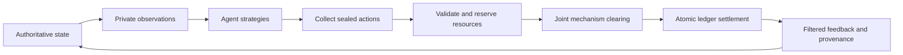

# Economic games for hypergraph agent swarms

Research date: **10 September 2026**. This is a design and source review for SwarmKit's Python library. Proposed APIs below are **not implemented**. Downloaded repositories were statically inspected; their experiments were not reproduced.

The most useful extension is a **game layer attached to persistent hyperedges**, with separate mechanisms, strategies, and evaluators. This would let the same swarm bargain over task assignments, compete for compute, fund shared evidence, form coalitions, and learn against a changing population. A hyperedge must retain its own participants, information rules, action timing, resource constraints, payoff function, and settlement history.

Start with interpretable mechanisms and exact small-game controls. Introduce learned strategies and learned institutions after their outcomes can be checked against those controls. Treat strategic diversity as a property of the evaluated population, rather than equating it with a count of differently worded agent prompts.

The [source archive](../sources/economic-games/README.md) contains PDFs, extracted text, blog snapshots, repository checkouts, commit records, and download failures. The [machine-readable candidate catalog](../sources/economic-games/method-candidates.json) translates this review into proposed implementation units. The [repository audit](../sources/economic-games/repository-audit.md) identifies concrete upstream entry points and reuse limits.

## What the repo already provides

| Existing component | Useful foundation | Missing economic behavior |
|---|---|---|
| [`HypergraphTopology`](../src/swarmkit/topology.py) | Incident groups determine reachable peers | `neighbors()` unions recipients. Group identity, joint action, valuation, and settlement do not survive that projection |
| [`AgentState`, `SwarmState`, `Task`](../src/swarmkit/types.py) | Identities, private evidence, memory, seeded state, metadata | Explicit private types, resource inventories, feasible actions, and ownership of contracts |
| [`SwarmRuntime`](../src/swarmkit/runtime.py) | Round-start snapshots and explicit outputs | Sealed submissions, economic observation views, joint clearing, and atomic settlement across overlapping groups |
| [`DAGExecutor`](../src/swarmkit/scheduling.py) | Dependency-constrained task execution | Negotiation over who executes a ready task, reservation prices, delivery obligations |
| [`CollaborativeReward`, `counterfactual_message_credit`](../src/swarmkit/learning.py) | Utility signals and leave-one-message-out evaluation | A strategic utility model; the existing credit calculation is neither a Shapley estimator nor an incentive-compatible payment |
| [`TrustNetwork`, `NamingGame`, `ProportionalCopying`](../src/swarmkit/social.py) | Interaction history, conventions, population updates | Contract performance reputation, costly cooperation, strategic misreporting, payoff-driven evolutionary games |
| [`ArtifactStore`, adoption and verification](../src/swarmkit/knowledge.py) | Durable evidence and evaluated artifacts | Transferable usage rights, delivery conditions, reward release following verified performance |
| [`MethodInfo` and catalog](../src/swarmkit/catalog.py) | Source/fidelity metadata for methods | Economic assumptions and supported equilibrium/evaluation concepts |

These findings come from local source inspection. Existing budget accounting measures actual provider usage; a proposed internal credit balance must remain a different quantity. Existing runtime snapshots also do not automatically constitute a complete private-information game interface: public artifacts and message histories require game-specific filtering.

## Represent the game without losing the hypergraph

Use a temporal attributed hypergraph `H_t = (V, E_t)`. For each interaction `e`, store ordered roles as well as membership, private types `theta_i`, legal actions `A_i`, observation rules `O_i`, a transition function, and local payoff contributions. An agent may choose a different action in each incident edge, but its spending and effort constraints must be enforced across all edges.

A useful default decomposition is:

```text
u_i = sum over incident edges e of u_i,e(joint_action_e, local_state_e, theta_i)
      + incoming_transfers_i - outgoing_transfers_i - execution_cost_i

sum over incident edges e of reserved_resource_i,e <= available_resource_i
```

This is a proposed modeling convention, not a universal factorization theorem. Some games have externalities between coalitions or global resource effects. Those need explicit coupling factors or a global utility callback; pretending they are independent local games would change the incentives.

For a public-goods hyperedge, a starting payoff is `u_i,e = r_e * sum_j(c_j,e) / |e| - c_i,e`. State whether each agent contributes once globally, independently per group, or divides a fixed effort budget across groups. Otherwise high-degree agents can receive or incur arbitrary extra payoff. Higher-order public-goods research motivates preserving actual group structure, but its cooperation findings depend on the chosen dynamics and network ensemble. [Alvarez-Rodriguez et al.](https://arxiv.org/abs/2001.10313)

For genuinely irreducible complementarity, use an illustrative three-agent task worth 12 only if all three specialists participate. Its value is `12*a*b*c` for binary participation. Every singleton and pair has zero value. A sum of constant, unary, and pairwise terms cannot reproduce all eight joint outcomes: its third mixed difference is zero, while this game's is 12. Turning that task into three pairwise links therefore loses the completion condition. This is our constructed example, not a reported experiment. Conversely, a linear public-goods payoff alone does not establish irreducible higher-order strategic effects; distinguish group bookkeeping from nonlinear complementarity.

Keep three relations separate: **communication** (who can hear whom), **economic interaction** (whose actions jointly affect allocation/payoffs), and **provenance** (which evidence or artifacts justify an outcome). They can share agent identities without sharing edges.

## Classical mechanisms and strategies worth implementing

The following are proposed SwarmKit applications of established ideas. An equilibrium is a solution concept; an auction is a mechanism; tit-for-tat is a strategy. Register these as different kinds of components.

| Family | Swarm application and strategy diversity | Conditions and boundary |
|---|---|---|
| Normal-form games: coordination, stag hunt, hawk–dove, prisoner's dilemma, matching pennies | Small local games for exploration versus verification, resource conflict, or coordination; fixed actions, mixed policies, best response, fictitious play | Payoffs must come from the actual modeled task. A matrix with a familiar name supplies no empirical justification for its numbers |
| Repeated games | Costly evidence sharing with reciprocal, forgiving, win-stay/lose-shift, always-cooperate, and always-defect strategies | Vary continuation probability, observation error, identity persistence, and partner turnover; no universal winner. [Axelrod implementation](https://github.com/Axelrod-Python/Axelrod) |
| Contract Net | Announce a task, invite bids, award work, verify delivery, close or reopen the contract | A task allocation protocol, not inherently a truthful auction or a coalition solver. Hypergraph bids extend the original individual-node protocol. [Smith, 1980](https://reidgsmith.com/The_Contract_Net_Protocol_Dec-1980.pdf) |
| First-price and second-price auctions; reverse procurement | Sell a scarce tool slot or procure a verification job; compare truthful, shaded, budget-aware, and random legal bids | Single-item private-value second-price truthfulness requires the standard utility and mechanism assumptions. Procurement reverses allocation/payment direction; report that explicitly |
| Combinatorial auctions and VCG | Bid for bundles of tools, time slots, or specialist teams; preserve task complementarities as hyperedges | General winner determination is combinatorial. VCG payments need counterfactual allocations. An arbitrary approximate optimizer can lose truthfulness |
| Double auctions and exchange | Agents sell surplus compute allocations or buy evidence services; compare zero-intelligence, truthful-reference, adaptive, and learned quoting | Specify clearing, tie-breaking, inventory, cancellation, and fees. A double auction is not automatically strategyproof or efficient |
| Congestion/potential games | Route agents among overloaded tools, reviewers, or retrieval services; best-response and no-regret routing | Keep the resource load visible to the cost function. Finite improvement guarantees of standard finite exact-potential games do not extend automatically to stochastic LLM workloads |
| Stable matching | Assign agents to reviewers or projects using both sides' preferences | Deferred acceptance provides a strong baseline in its classical domain. Arbitrary team complementarities and overlapping projects exceed ordinary matching assumptions. [Gale–Shapley, 1962](https://www.math.utoronto.ca/mccann/assignments/477/GaleShapley62.pdf) |
| Nash bargaining and alternating offers | Negotiate price, deadline, quality, and evidence disclosure; deadline concessions, hardline offers, reciprocal concessions | Nash bargaining is an axiomatic allocation solution, not itself a dialogue policy; model disagreement payoffs explicitly. [Nash, 1950](https://www.haverford.edu/sites/default/files/Nash1950.pdf), [NegMAS mechanisms](https://negmas.readthedocs.io/en/latest/negotiation_mechanisms.html) |
| Cooperative coalition games: Shapley value, core, graph-restricted value | Attribute joint artifact value and decide which teams can remain together | Fair attribution does not establish truthful reporting or coalition stability. Core constraints require every modeled coalition's feasible deviation; the core can be empty. Myerson motivates cooperation restrictions, but a hypergraph extension needs its own definition. [Myerson, 1977](https://pubsonline.informs.org/doi/10.1287/moor.2.3.225) |
| Public goods and threshold provision | Fund a shared test suite, evidence pool, or reusable procedure; contribute, free ride, reciprocate, sanction, or exit | Nonlinear thresholds fit complementary team tasks. Include enforcement cost and observed rather than invented reputation. [Higher-order public goods](https://arxiv.org/abs/2001.10313) |
| Prediction markets and scoring rules | Reward forecasts about whether an artifact will pass a later independent test | Separate forecast quality from the ability to affect the outcome. Specify outcome resolution and subsidy. LMSR prices are not a general guarantee of truthful multi-round reporting. [Hanson](https://hanson.gmu.edu/mktscore.pdf) |
| Stackelberg/principal–agent models | A scheduler posts rewards or audit rates; workers choose bids and costly effort | Useful future family, but this collection does not independently cover the full contract-theory literature. Begin with explicit small finite leader/follower games and simulated delivery; treat richer claims as follow-up research |

For the classical auction, congestion, and equilibrium background, the archived [Roughgarden lecture notes](https://theory.stanford.edu/~tim/f13/l/f13.pdf) provide an accessible technical starting point. The [price-of-anarchy survey](https://arxiv.org/abs/1607.07684) explains why equilibrium efficiency needs mechanism-specific assumptions, including when conclusions extend to learning or incomplete information. Do not turn an observed efficiency gap in one simulation into a theorem-level price-of-anarchy claim.

## Modern techniques and what they add

| Technique | Evidence and proposed application | Main limit |
|---|---|---|
| External regret, internal/swap regret, correlated recommendation | Use online learners over bidding or routing policies; a mediator can recommend coordinated actions. [Hart–Mas-Colell](https://ma.huji.ac.il/~hart/abs/adapt.html) | External no-regret gives the empirical coarse-correlated-equilibrium connection; internal/swap regret supports correlated equilibrium. Neither generally means last-iterate Nash convergence |
| Counterfactual regret minimization (CFR) | Solve small imperfect-information bargaining or bidding games through an optional [OpenSpiel](https://arxiv.org/abs/1908.09453) adapter | Standard average-policy Nash guarantees apply to appropriate two-player zero-sum perfect-recall settings, not arbitrary multiplayer economic games |
| PSRO / empirical game-theoretic analysis | Build a population of agent strategies, evaluate their interactions, train or search for responses, and retain diverse specialists. [Lanctot et al.](https://arxiv.org/abs/1711.00832) | A language prompt search is an approximate response oracle. An equilibrium of the restricted population does not certify robustness against all possible agents |
| AlphaRank / evolutionary dynamics | Inspect nontransitive strategy populations, so cyclic strengths are visible instead of forcing a single winner. [Omidshafiei et al.](https://arxiv.org/abs/1903.01373) | Ranking depends on empirical payoffs and dynamics parameters; it is not a welfare objective or a Nash certificate |
| LOLA and POLA | Learn strategies accounting for opponents' learning, supporting experiments in reciprocal collaboration. [LOLA](https://arxiv.org/abs/1709.04326), [POLA](https://arxiv.org/abs/2210.10125) | Needs learning-model assumptions and usually differentiable policies. Frozen API agents do not expose the gradients required for a faithful implementation |
| Mean-field and multi-type mean-field RL | Approximate large homogeneous populations, with different representative populations for scouts, reviewers, and brokers. [Yang et al.](https://arxiv.org/abs/1802.05438), [Subramanian et al.](https://arxiv.org/abs/2002.02513) | An average neighbor can erase rare specialist bottlenecks and group thresholds; compare against explicit small hypergraphs before scaling |
| Learned auction design / RegretNet | Learn allocation and payment functions with incentive-violation penalties. [Dütting et al.](https://proceedings.mlr.press/v97/duetting19a.html) | Small empirical regret over sampled/search-generated deviations is not exact dominant-strategy incentive compatibility; test unseen values and stronger deviations |
| Two-level learned institutions | Learn a scheduler's taxes, subsidies, or reward rules while workers adapt. [AI Economist](https://arxiv.org/abs/2108.02755) | Results are for modeled economies. Changing the reward rule changes the agents' game; evaluate strategic adaptation and held-out populations |
| Other-regarding hypergraph Q-learning | Condition an agent's behavior on other contributors' previous actions within a group. [Li et al.](https://arxiv.org/abs/2410.10921) | This paper's other-regarding state representation must not be casually relabeled an altruistic reward. Its particular lattice/hypergraph and Q-learning results are not universal cooperation guarantees |
| Language negotiation and self-play | Make structured offers and use language for persuasion or justification; compare fixed policies with learned dialogue. [Deal or No Deal](https://arxiv.org/abs/1706.05125), [non-zero-sum language self-play](https://arxiv.org/abs/2406.18872) | Test against unseen partners and objective payoffs; fluent agreement is not a valid or mutually beneficial allocation |
| Language-based information design | Compare evidence selection and framing while holding underlying facts fixed. [Dütting et al.](https://arxiv.org/abs/2509.25565) | A modeled framing-to-belief oracle does not establish how arbitrary deployed agents or humans respond. Preserve provenance and separately measure accuracy and sender benefit |

One concrete code-reading lesson: OpenSpiel's `python/algorithms/regret_matching.py` accumulates a vector of action regrets against current expected payoff. Its name and citation alone are insufficient grounds for advertising the original Hart–Mas-Colell correlated-equilibrium procedure. The future catalog should record the actual update, feedback access, and convergence target.

## What recent LLM evidence does and does not establish

[AucArena](https://arxiv.org/abs/2310.05746) offers a structured auction environment for planning, resource management, and goal adherence. It is useful as an adapter target and a prompt/action-validation reference. Its benchmark findings do not show that LLM bidders implement optimal strategies across mechanisms.

The September 2026 preprint [Competitive Market Behavior of LLMs](https://arxiv.org/abs/2609.02580) reports incomplete convergence in its tested Smith-style double-auction populations. It explicitly limits conclusions about model scale and suggests extending horizons and market conditions. Use this as evidence that institution-level behavior needs measurement, rather than assuming capable models reproduce human market outcomes. Its [linked repository](https://github.com/jswistak/competitive-market-simulation) was downloaded and provides a concrete recent experimental starting point.

[GameBench](https://arxiv.org/abs/2406.06613) examines several strategic-reasoning tasks and reports substantial weaknesses for the models it tested. It supports diverse task evaluation; it is not a contemporary leaderboard for all currently available models.

The downloaded [PACT](https://github.com/lechmazur/pact) and [BAZAAR](https://github.com/lechmazur/bazaar) repositories provide useful protocol descriptions, prompts, and transcripts. At the recorded commits, they do **not** provide the executable Python harnesses their descriptions might lead a reader to expect. Treat their score claims as author-reported, unreproduced evidence. Do not promise to import their described baseline agents.

The archived primary blogs explain [social dilemmas](https://deepmind.google/blog/understanding-agent-cooperation/), [evaluation with unfamiliar partners](https://deepmind.google/blog/melting-pot-an-evaluation-suite-for-multi-agent-reinforcement-learning/), [bartering](https://deepmind.google/blog/emergent-bartering-behaviour-in-multi-agent-reinforcement-learning/), and [learned economic institutions](https://www.salesforce.com/blog/the-ai-economist/). These are useful explanatory companions to papers and code, not independent replication evidence.

## Proposed Python architecture

Keep the current NumPy-only core; put external solvers, hypergraph packages, and neural training behind optional adapters. The following names describe a proposed API, not current imports.

| Proposed record/protocol | Required responsibility |
|---|---|
| `EconomicHyperedge` | Stable ID, members, ordered roles, mechanism ID, task/resource references, start/end conditions, observation policy |
| `PrivateType` / `EconomicObservation` | Private value, costs, capability/endowment and role; publish only the mechanism-permitted view |
| `EconomicAction` | Typed bid, offer, contribution, acceptance, withdrawal or abstention with edge/round IDs |
| `GameModel` | Legal actions, local/global payoff terms, transition, terminal condition, and information structure |
| `Mechanism` | Validate joint submissions, choose allocations, compute transfers, emit auditable settlement events |
| `Strategy` | Map an authorized observation and private memory to a legal action; optionally update from explicit feedback |
| `Ledger` / `Settlement` | Inventories, available/reserved balances, transfers, explicit subsidies, contract delivery status, idempotency keys |
| `SolutionConcept` / `GameEvaluator` | Declare Nash/CE/CCE/core/ranking targets and estimate the corresponding deviations or welfare measures |
| `PopulationTrainer` | Maintain policy identities, cross-play results, uncertainty, new candidate responses and evaluation splits |

Suggested package boundaries are `swarmkit.economics.{types,games,mechanisms,strategies,ledger,evaluation}` and optional `adapters.{openspiel,negmas,hypernetx,xgi}`. Keep mechanism selection independent from agent/model selection. A scripted bidder, a tabular learner, and an LLM bidder should submit the same action type.

Use `AgentState.memory` for a player's strategy history and `SwarmState.data` for serializable authoritative game state initially. Do not put callable payoff functions or live solver instances into checkpoints; keep them in a registry and serialize their IDs/configuration. Runtime agents should receive filtered economic observations rather than arbitrary authoritative state.

An economic round needs an explicit transaction boundary:



Resolve simultaneous actions together. Do not publish a sealed bid through the ordinary broadcast bus. If two overlapping auctions each attempt to spend an agent's same ten credits, the library needs either a joint feasibility optimizer or an explicitly ordered reservation/clearing policy. Ordering is part of the game, so record it and measure order sensitivity.

For uncertain task delivery, distinguish contract award, resource reservation, execution, verification, and payment release. Reuse `Artifact` and `Feedback.verified` as inputs, while requiring an application-defined verifier. A message claiming completion cannot itself authorize payout. Bind outcomes to contract, task, participant, and settlement IDs so retries cannot pay twice.

Suggested core invariants: conservation of resources; transfers net to zero except declared mint/burn/subsidy accounts; no spending reserved funds twice; no payoff to a nonparticipant unless explicitly modeled; no private-type leakage; deterministic tie-breaking under a seed; and no state change after an invalid joint settlement. Agent exit must settle or cancel outstanding obligations under a stated rule.

## A diverse strategy library

Build diversity along independent axes rather than adding dozens of unstructured personas:

| Axis | Initial options |
|---|---|
| Objective | Own surplus; common task value; inequality-sensitive utility; risk aversion; constrained budget |
| Information | Private values; public history; noisy partner observations; costly evidence acquisition |
| Time horizon | Myopic; discounted repeated interaction; deadline-sensitive; finite resource exhaustion |
| Adaptation | Fixed rule; fictitious play; external regret; internal regret; Q-learning; opponent model; PSRO response search |
| Social behavior | Reciprocity; forgiveness; contribution thresholds; coalition entry/exit; reputation-based partner selection |
| Implementation | Scripted numerical policy; learned numerical policy; language policy that emits validated actions |

Changing an objective changes the game; changing an observation changes available information; changing a strategy changes behavior within that game. Record all three in experiment manifests. “Altruistic” agents should have an explicit welfare term, not just a cooperative prompt label. An LLM planner can choose among numerical strategies while a deterministic mechanism enforces legality.

## Build order and acceptance experiments

| Stage | Deliverable | Required evidence before expanding |
|---|---|---|
| 1: semantic foundation | Edge IDs, private views, actions, ledger, normal-form/repeated/public-goods games; fixed policies | Hand-solvable outcomes, budget and privacy invariants, checkpoint/retry consistency, simultaneous-action ordering controls |
| 2: allocation | Contract Net, single-item auctions, double auction, congestion routing, stable matching | Exhaustive small-instance allocations; known payment cases; infeasible bid rejection; scripted controls; role permutations |
| 3: true group strategies | Bundle bids, threshold tasks, coalition values, bargaining | Joint specialist fixture, exact small VCG counterfactuals, individually rational offers, core-violation checks where supported |
| 4: adaptive populations | Regret learners, evolutionary updates, empirical payoff tensors, PSRO, optional OpenSpiel/NegMAS | Hold out partners and task instances; measure regret type accurately; show cycles and uncertainty rather than only scalar ranks |
| 5: research extensions | Learned mechanisms, two-level institutions, opponent shaping, multi-type mean field, information design | Stronger deviation searches, shifted valuation distributions, explicit model-access assumptions, comparison with earlier baselines |

Recommended first end-to-end experiment: **procurement of verified team artifacts**. A task requires a scout, an analyst, and a reviewer. Agents have private execution costs and limited effort. Teams submit bundle bids; a selected team delivers an artifact; a held-out verifier determines success; the contract settles; policies learn from realized utility. Compare fixed assignment, capability routing, individual procurement, team procurement, and team procurement with negotiated surplus sharing. The hypergraph matters because any incomplete team fails the fixture.

Recommended second experiment: **shared evidence under scarce compute**. Overlapping groups decide whether to contribute to a reusable evidence pool while competing for limited tool capacity. Combine a public-goods payoff with a congestion cost. Compare individual versus per-group contribution, equal versus negotiated credit, free riders, reciprocal policies, and no-regret routing. Hold actual tool-call budgets fixed across conditions.

Recommended third experiment: **unfamiliar market partners**. Adapt the downloaded double-auction simulator to run scripted, LLM, and mixed populations using the same structured action schema. Cross play every policy against several partner mixtures with paired valuation schedules. Compare auctions with and without language, while preserving identical clearing rules. This separates language effects from changes in the institution.

Metrics must cover several questions:

- **Task value:** independently verified output quality, useful artifacts, latency, actual calls/tokens/cost.
- **Economics:** welfare/gains from trade, surplus by role, budget violations, inventory conservation, participation and failed delivery, concentration of rewards.
- **Strategic stability:** unilateral deviation gains, external or swap regret as appropriate, coalition blocking gain, response-oracle search budget. A sampled deviation maximum is only a lower bound on the true worst-case gain.
- **Robustness and diversity:** full cross-play matrix/tensor, performance under agent turnover and noisy messages, policy occupancy, worst-partner performance, failure under coordinated deviations or duplicated identities.
- **Uncertainty:** multiple independent seeds, paired tasks, intervals over independent runs, and separation of training versus held-out games. Avoid treating many rounds from one trajectory as independent samples.

For a mixed profile, Nash deviation gain is the sum over players of their best unilateral improvement with others held fixed. In large language-action spaces, label estimates by the restricted action set or response search used. Similarly, call measured welfare divided by an oracle optimum an empirical efficiency ratio; reserve theoretical price-of-anarchy terminology for the relevant equilibrium worst-case analysis.

## Selection judgment and remaining gaps

**Highest implementation value:** persistent economic hyperedges; atomic settlement; Contract Net; public/threshold goods; exact small auctions; bargaining; regret learners; and cross-play evaluation. These fit the existing records and runtime while creating genuinely different strategic behaviors.

**Best optional references:** OpenSpiel for game/solver interfaces, NegMAS for negotiation composition, Axelrod for repeated strategies, Nashpy/Gambit for small-game controls, and HyperNetX/XGI for structural analysis. AI Economist and Melting Pot are larger environment references. The original RegretNet checkout is a historical research artifact requiring modernization, not a drop-in Python dependency.

**Open questions:** how to estimate coalition value without prohibitive repeated LLM evaluation; how much structure can be factored before losing strategic effects; whether internally transferred credits predict real resource efficiency; whether reputation and contract incentives improve verified task outcomes; and whether learned policies generalize across institutions rather than only across partners.

Coverage is selective, not a systematic-review claim. The original RAND Shapley download was blocked; its failure is retained in the manifest. The Myerson working-paper PDF is scanned and its text extraction is not usable; the publisher abstract supports only the broad connection cited above. Rubinstein bargaining, hedonic/partition-function games, proper scoring/peer prediction, market design impossibility theorems, and full principal–agent theory deserve a focused follow-up before strong guarantees are attached to those extensions. No claim here establishes that economic competition improves real swarm tasks; the proposed experiments are designed to test that question.
