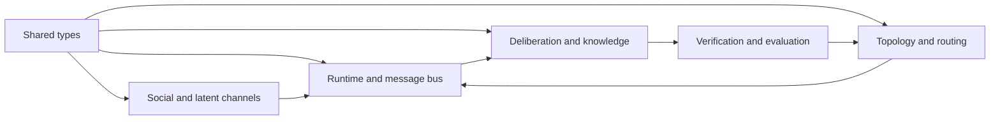

# swarmkit

A Python library for **agentic swarms, social agent populations, and collective knowledge**. It implements the major algorithm families in the accompanying research collection through one shared type system.

The library contains **49 registered methods**, including topology learning, evidence exchange, artifact inheritance, social conventions, gossip, trust, latent communication, and coordination-policy learning. Methods are composable implementations and explicitly labeled adaptations—not a claim to reproduce every paper's models, environments, or benchmark results.

[Algorithm catalog](../docs/METHODS.md) · [API and composition](../docs/API.md) · [Research report](../SWARMS_REPORT.md) · [Source archive](../sources/catalog.json) · [Attribution](../THIRD_PARTY_NOTICES.md)

## Install and run

Python **3.10+**; NumPy is the only required third-party dependency. No model credentials are needed for the examples.

```bash
python3 -m venv .venv
source .venv/bin/activate
python -m pip install -e ".[dev]"

python -m swarmkit list
python -m swarmkit list --family knowledge --json
python -m swarmkit demo
python examples/collective_discovery.py
python examples/social_culture.py
python examples/learn_topology.py
python -m pytest -q
```

`python -m swarmkit demo` shows independent voting choosing **A**, followed by evidence exchange changing the collective answer to **B**. The topology-learning example learns which messages improve a receiver's decision. These are deterministic, local fixtures, not benchmark reproductions.

## A shared type library

Every subsystem uses [swarmkit.types](../src/swarmkit/types.py):

| Contract | Purpose |
|---|---|
| `AgentState`, `SwarmState` | Private evidence, local memory, active membership, shared artifacts, population history, seeded RNG |
| `Task`, `AgentContext`, `AgentOutput` | Provider-neutral work and agent invocation |
| `Evidence`, `Message`, `Decision` | Attributed facts, communication and decisions |
| `Artifact`, `Feedback` | Reusable outputs, ancestry and external evaluation |
| `AlgorithmResult` | The common output of composable swarm stages |
| `LatentPayload`, `KVCache` | Numerical communication through the same model-independent boundary |
| `Budget`, `Usage` | Dispatch limits and observed resource use |
| `Agent`, `TopologyPolicy`, `SwarmAlgorithm`, `ArtifactVerifier` | Structural protocols for extending the library |

There are no separate message or evidence classes for individual papers. Method-specific configuration and metric records supplement these contracts.



## Example: elicit private evidence before deciding

```python
from swarmkit import AgentState, Evidence, Pipeline, SwarmState, Task
from swarmkit.deliberation import ExchangeThenDecide, WeightedConsensus

old_map = Evidence(
    "map", "The old map recommends A", "map-v1", "scout",
    confidence=0.4, supports=("A",),
)
new_survey = Evidence(
    "survey", "A is closed; B is passable", "survey-v2", "scout",
    supports=("B",), contradicts=("A",),
)
state = SwarmState({
    "scout": AgentState("scout", private_evidence=(old_map, new_survey)),
    "planner": AgentState("planner", private_evidence=(old_map,)),
    "reviewer": AgentState("reviewer", private_evidence=(old_map,)),
}, seed=7)
task = Task("route", "Choose a passable route", candidates=("A", "B"))

exchange = ExchangeThenDecide()
result = Pipeline([exchange, exchange, exchange]).step(state, task)
answer = WeightedConsensus().aggregate(result.decisions, task)
assert answer.metadata["winner"] == "B"
```

The default protocol explicitly models **all-peer exchange**. For constrained communication, select `ExchangeConfig(delivery="inbox")` and supply a topology to `MessageBus`. Only delivered evidence becomes visible; unresolved ancestry remains local until its supporting records arrive.

## Implemented families

| Family | Implementations and research lineage |
|---|---|
| Topology and allocation | Full/ring/star/random/spatial/hypergraph communication; GPTSwarm-style Bernoulli DAG learning; pruning with optional nuclear regularization; round-specific AgentDropout masks; DyLAN contributor selection; AgentNet-style success routing |
| Collective reasoning | Independent vote controls, weighted/stable consensus, evidence-first exchange, callback-driven critique/revision |
| Collective knowledge | Evidence ancestry and independent-source accounting; verified immutable artifact stores; local adoption and rollback; decaying memory; cultural transfer; held-out abstraction; stigmergic artifact discovery |
| Social swarms | Naming-game conventions and committed minorities; proportional-copying null; ranked/diversified feeds; directional contextual trust; synchronous bounded gossip |
| Latent channels | Model/layer-compatible latent memory; centered/whitened Procrustes; vocabulary anchoring; ridge and contrastive adapters; PCA bottlenecks; key/value translation |
| Learning and search | REINFORCE and clipped PPO for coordination policies; measured peer-influence rewards; annealed useful-parallelism rewards; message-ablation credit; personal/global-best artifact search |
| Execution and evaluation | Bounded async runtime; dependency-aware parallel tasks; critical-path accounting; private-evidence recovery; diversity, reciprocity and higher-order topology; transfer gain; matched independent controls |

The [complete catalog](../docs/METHODS.md) links every entry to its public API, sources, and fidelity boundary. `swarmkit.methods()` returns the same metadata programmatically; `swarmkit.resolve(name)` resolves a registered implementation.

## Composition and real models

`SwarmAlgorithm.step(state, task)` returns `AlgorithmResult`. Algorithms may update their own memory and learned state. **`Pipeline` commits messages/artifacts and advances population time.** Direct callers use `apply_result(state, result, bus)` and advance `state.step` explicitly.

`SwarmRuntime` runs asynchronous `Agent.act(context)` implementations concurrently against round-start snapshots. `CallableAgent` adapts ordinary functions; `CompletionAgent` adapts a sync or async text-completion function. This supports model SDKs, local inference engines, and tool-backed agents without binding the shared types to a provider. [Provider example and detailed contracts](../docs/API.md#connect-a-model-or-tool-backed-agent).

Runtime contexts contain the receiving agent's state and delivered messages. Tasks and the artifact store are explicitly public. Agent callbacks receive copies; outputs are validated before commit. In-process callbacks and artifact verifiers are trusted application code, not sandboxed programs.

`Budget.max_calls` bounds dispatched `act()` invocations. Token and monetary usage are reported after calls and stop subsequent dispatch; already-running calls can exceed these soft limits. Async timeouts stop awaiting a call; they cannot terminate a synchronous worker thread or undo external effects.

State can be saved with `swarmkit.serialization.save` and restored with `load`. Snapshots preserve canonical types, numerical arrays and RNG state without pickle or arbitrary imports. Algorithm/backend objects and trained codec parameters require separate configuration; arbitrary callables in state are rejected.

## Fidelity and coverage boundaries

The library implements algorithmic mechanisms, with working adapters and controlled tests. It does **not** bundle proprietary PARL checkpoints, reproduce full MAPoRL transformer training, run the complete SwarmWorld/SwarmBench environments, or reproduce every model-specific latent implementation. Their transferable mechanisms are mapped explicitly in [METHODS.md](../docs/METHODS.md).

Named adapters state their differences. Examples include externally supplied dropout importance, a local trust formula rather than an unavailable server algorithm, and linear/contrastive latent channels rather than a published model's complete training pipeline. Abstracting procedures, mutating candidate systems, and judging real artifacts require task-specific callbacks.

The source collection remains available: **41 papers, 16 first-party post/platform snapshots, 35 GitHub clones, one Bitbucket clone, and one SDK package**. It is excluded from the Python distribution. All new library code is independently written; upstream repositories retain their own licenses.

## Development

```bash
python -m pytest -q
ruff check src tests examples
python -m build
```

Tests cover source deduplication, hidden-information recovery, topology restrictions, failed verification and rollback, seeded learning, numerical adapter recovery, message isolation, transactionality, cancellation, dependency failures, budgets, and checkpoint continuation. Research experiment claims remain in [SWARMS_REPORT.md](../SWARMS_REPORT.md).
